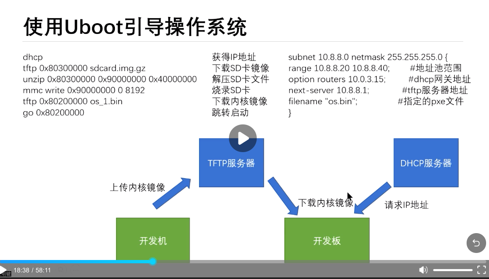

# Board

## 指拨开关与启动方式

hifive 的板子有多种启动方式，按照赛题的要求，我们需要将其调整到 flash 启动，而不是 SD 卡启动，因为比赛的磁盘镜像拷贝首地址是 SD 卡的第 0 块，如果用 SD 卡启动，bootloader 会占用 SD 卡前面的部分。

具体的调整方式就是将指拨开关设置为 MSEL[3:0] to 0110。

按理说，hifive 的 flash 上应该已经有了 spl，sbi，uboot，所以就不再需要编译和烧录了。

## uboot 网络启动

按照理论来讲，我们需要将编写好的内核和磁盘镜像都烧录到 SD 卡上，然后启动，但是这种方式需要重复烧录和插拔 SD 卡，不太方便。所以我们采用网络启动的方式，通过网络将内核拷贝到内存，将磁盘镜像烧录到 SD 卡。

### tftp 服务器搭建

为了实现这个功能，我们需要在开发环境上搭建 tftp 服务器：

安装 tftp 客户端

```shell
yaourt -S tftp-hpa
```

配置 `/etc/hosts.allow` 文件

```
tftpd:ALL
in.tftpd:ALL
```

修改默认的 tftp 目录（也就是在这个目录下内容可以被 uboot 下载）

```
/etc/conf.d/tftpd
   TFTPD_ARGS="-l -s /home/yun/xuexi" 
```

启动 tftp 服务器

```shell
systemctl start tftpd.socket tftpd.service
systemctl enable tftpd.socket
```

### uboot 配置

首先设置如下环境变量

```shelll
=> setenv serverip 10.0.0.5
=> setenv ipaddr 10.0.0.6
=> setenv netmask 255.255.255.0
=> setenv kernel_addr_r 0x80200000
=> setenv env_addr_r 0x83000000
=> saveenv
```

比赛使用如下命令



## 参考资料

- [uboot 文档](https://u-boot.readthedocs.io/en/latest/board/sifive/unmatched.html)
- [manjaro 搭建 tftp](https://blog.csdn.net/qq_37421762/article/details/95235918)

