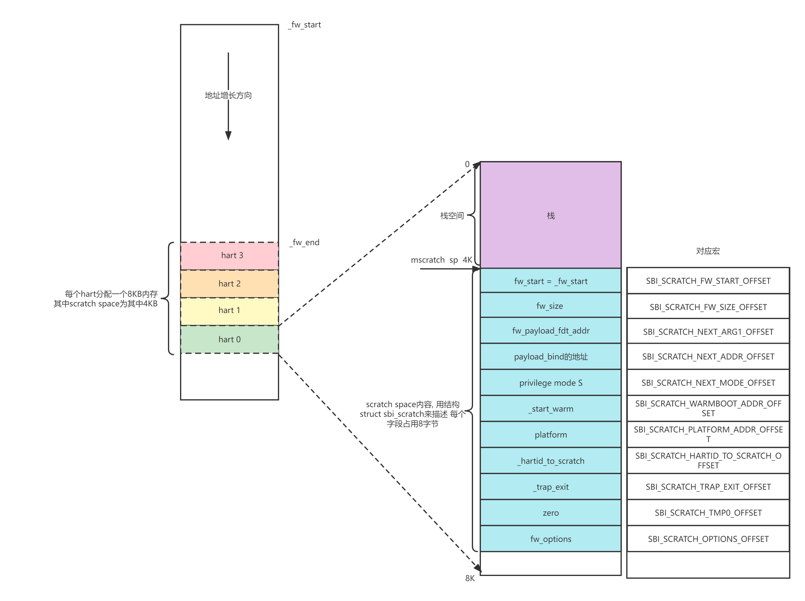

# Boot

## 总论

### Bootloader

bootloader 是加载程序的意思，它用于加载下一级 bootloader 或者操作系统（加载的意思就是“自由使用被加载对象”）。其中最大的误区就是认为 bootloader 是操作系统的一部分，bootloader 和操作系统或者其他 bootloader 并不是“一个程序”，而是多个程序“他们的符号表不重叠，生命周期也基本上不相交”。一个操作系统可以用多种 bootloader 引导，没有一对一的关系。

和操作系统同样，bootloader 需要处理的也是硬件资源的使用问题，甚至情况会比操作系统更加严峻一些，因为 bootloader 可以使用的硬件资源会更加受限（正是 bootloader 将硬件资源初始化好提供给 OS）。

常见的 bootloader 有 GRUB（PC 端 linux 系统的bootloader），LILO（被 GRUB 替代），U-boot（嵌入式开发的 bootloader，能够被用于很多不同的嵌入式系统平台）。

换句话说，bootloader 没有解决 OS 的自举问题，bootloader 根本不是 OS 的一个部分。

### Bios

BIOS（Basic Input/Output System）是嵌入计算机主板固化芯片中的一个软件，管理基本的硬件接口。

BIOS主要负责检测计算机硬件设备，然后启动Bootloader或其他的启动介质来加载操作系统。也就是说，bios 的在启动流程中是先于 bootloader 的。

BIOS一般来说是固化不变的，除非更新基板上的固件，而 Bootloader 可以按照用户的需要进行更改，以支持不同的计算机环境和需求。

BIOS 是独立于操作系统的，通常可以被用于加载不同的操作系统。而 Bootloader 是针对特定的操作系统，不同的操作系统使用不同的Bootloader（但是也不是一对一关系的）。

基于 UEFI 的操作系统（如最新版 Windows ）已经不使用传统的 BIOS 而是使用 UEFI 替代。UEFI 比传统的 BIOS 更加灵活和强大，提供了更多的特性，可以加载操作系统和引导程序，同时，UEFI内部集成了一个输出显示系统，支持复杂的GUI（图形用户界面)，这些都是传统 BIOS 所没有的。

在启动流程上，认为 bios 是一种“bootloader”，也是没有问题的，毕竟它承担了一个“加载”任务。

### bootload 的特点

在现在的系统启动中，bootload 的过程一般是多级的，这是因为一次的 bootload 并不能完成全部的加载任务。这是因为加载需要利用外设，而外设的初始化任务是在加载中完成的，所以只有一步步地将外设初始化好，才能完成更加复杂的加载任务。

bootload 是与硬件息息相关的，对于不同的硬件平台，bootload 的级数和每一级的 bootloader 都有可能发生变化，这是因为不同的硬件平台的硬件资源是不同的，那么显然 bootloader 需要发生对应的调整。同时如果 OS 的功能强大一些，也是可以省略一些 bootloader 的，相当于将一部分 bootloader 的任务移交给 OS 实现，比如说我们在 armv8 的移植中，就进行了很多硬件结构相关的代码实现。

### Device Tree

将 sbi 用于 bootload 过程是 RISCV 的一种创新性的设计。正如先前所述，硬件平台的资源是不同的，这就导致 bootload 的流程是不同的，我们希望有一套规范，可以提供操作系统的在相同架构不同硬件平台上的可移植性。这种可移植性看上去似乎是天生的（又不是 X86 的操作系统移植到 RISCV 上），但是简单思考就可以明白，正是因为硬件资源的不同，导致了这种可移植性的丧失。

硬件资源在软件上对应驱动（当然 OS 或者 bootloader 也可以看做是驱动的集合），我们可以考虑硬件资源写成配置文件交给软件，这种结构的可移植性就好过了将硬件参数写死在软件中。这种“配置文件”叫做设备树。

设备树（Device Tree）是一种数据结构，用于描述计算机系统的硬件架构和设备信息，提供一种标准的、可移植的方法来管理硬件资源。它通常被用作操作系统内核启动时用于识别和配置硬件设备的基础信息。

在计算机系统中，硬件设备通常是递归层次结构的，即需要一个设备来支持其他设备的工作，这些设备和它们支持的设备之间存在着一种父子关系。比如，一个主板上可能会有多个总线，每个总线上又可以挂载许多设备，而这些设备间又可能存在依赖关系。因此，为了准确描述和管理这种层次关系，更方便地管理硬件资源，使用树形结构进行组织是比较合理的。

需要注意的是，似乎设备树即使提高了移植性，但是这种“可配置”是在编译时而不是在运行时，也就是说，当硬件设备发生变化的时候，我们除了修改设备树文件外，还需要重新编译（但是不用修改驱动的源码了），这可能是由于驱动是比较底层的代码实现，所以不支持读入配置。但是这种特性就造成了对于非开发人员并不友好，我总不能因为我的电脑换了一个硬盘，就将我的 win11 重新编译一遍吧。

### SBI

在现实中，换个硬盘显然不需要重新编译 win11，这似乎是因为 intel 公司的某种设计导致的，但这并不是与生俱来的，比如说对于 arm 体系结构（移动端芯片的主流），对于不同的硬件平台，需要重新编译操作系统，这可能是没啥人改装手机的原因。

RISCV 和 X86 体系一样，相同架构不同平台的移植是不需要重新编译的。这得益于 sbi 的设计：sbi 加载设备树，为直接运行在系统M模式（机器模式）下的程序，向上层 OS 提供了统一的系统调用环境，SBI 程序拥有最高的权限，可以访问所有的硬件资源，同时其控制PMP等硬件级的权限管理单元，将系统划分为多个域(domain)以供上层不同的安全等级的多操作系统使用并不会造成数据侵入破坏。在更换平台的时候，只需要重新编译 sbi 即可（这也是为什么 openSBI 项目的 `make` 规则如此复杂，是为了指定不同的硬件平台）。

原来的启动流程一共是分为 3 级：


现在用 openSBI 替换 BBL：


有的时候为了让 boot 的功能更加强大，我们考虑使用 Uboot，这也是 linux 的启动方法，但是在我们的操作系统开发中，并不涉及这种方法，各种示意图中经常出现 Uboot，忽略即可：


最终给出一个每个阶段大致功能的图


---


## openSBI 

### 三种固件

OpenSBI 为特定平台提供固件构建，支持不同类型的固件来处理不同平台早期启动阶段之间的差异。所有固件将根据平台特定代码以及 OpenSBI 通用库代码执行平台硬件的相同初始化过程。三种固件主要在如何处理下一阶段上存在差异（我个人感觉）：

- `payload` 是将下一个阶段（一般是 OS 或者 uboot）的二进制文件一起打包进来，所以会直接继续执行文件，并不存在 jump 的行为（可能这种固件和 OS 的联系更加紧密吧）。
- `jump` ：与 payload 相反，`jump` 并不打包，而是很传统的通过 jump 将控制权交给下一阶段。
- `dynamic`： 与 `jump`处理方式类似，区别在于可以接受上一阶段传递来的参数，这个参数（是一个结构体指针）可以规定许多行为，比如说结束 openSBI boot 后需要跳转到哪里。

#### FW_PAYLOAD


该类型的固件直接包含了下一引导阶段的二进制代码，被包含的代码称为 “payload”。payload 通常是 bootloader 或操作系统内核。这种固件允许用户重写设备树文件（DTB）。当上一引导阶段没有传递扁平设备树文件（FDT 文件）时，它可以在最终固件的 `.rodata` 字段中嵌入 FDT。

#### FW_JUMP


该类型的固件会跳转到给定的地址。与 fw_payload 不同的是，其不包含下一引导阶段的二进制代码。该类型固件曾经是 QEMU RISC-V ‘virt’ 平台的默认固件。

#### FW_DYNAMIC


该类型的固件会在 Runtime 阶段从上一引导阶段获得下一引导阶段的入口，下一阶段通常是 Bootloader 或操作系统内核。目前，此类固件是 QEMU 的默认固件。

RISC-V ‘virt’ 平台在上一引导阶段创建 `struct fw_dynamic_info` 这一结构体，并将其在内存中的地址通过 RISC-V CPU 的 a2 寄存器传递给 FW_DYNAMIC。由于该类型固件所需的信息能够通过这一结构体传递，其并没有特有的编译时配置选项。`struct fw_dynamic_info` 如下所示：

```c
/** Representation dynamic info passed by previous booting stage */
struct fw_dynamic_info {
    /** Info magic */
    target_long magic;
    /** Info version */
    target_long version;
    /** Next booting stage address */
    target_long next_addr;
    /** Next booting stage mode */
    target_long next_mode;
    /** Options for OpenSBI library */
    target_long options;
    /**
    * Preferred boot HART id
    *
    * It is possible that the previous booting stage uses same link
    * address as the FW_DYNAMIC firmware. In this case, the relocation
    * lottery mechanism can potentially overwrite the previous booting
    * stage while other HARTs are still running in the previous booting
    * stage leading to boot-time crash. To avoid this boot-time crash,
    * the previous booting stage can specify last HART that will jump
    * to the FW_DYNAMIC firmware as the preferred boot HART.
    *
    * To avoid specifying a preferred boot HART, the previous booting
    * stage can set it to -1UL which will force the FW_DYNAMIC firmware
    * to use the relocation lottery mechanism.
    */
    target_long boot_hart;
};
```

### 冷启动和热启动

当一个 RISC-V 系统启动时，需要确定哪个 HART 将成为启动 HART，并负责初始化和加载其他 HART 和系统的操作系统。这个过程被称为冷启动（Cold Boot）。在多核系统中，需要确保各个 HART 在启动时按照正确的顺序初始化和启动，以避免出现不必要的错误。

在系统运行时，一些 HART 可能因为软件问题或异常而需要重新启动，而此时不想中断整个系统的运行或关闭电源，就可以采用热重启（Warm Boot）的方式，将需要重启的 HART 重新初始化和加载。

为了实现这些功能，OpenSBI 提供了系统固件，并且定义了一些规则和协议，以实现冷启动和热重启的操作。具体而言，启动 HART 将负责初始化所有 HART 和系统，在启动下一个 HART 之前，需要保存当前 HART 的状态到 scratch 寄存器中。在下一个 HART 初始化和启动时，SBI 会将上一个 HART 的状态从 scratch 寄存器中加载回来，并运行对应的初始化代码。这个过程可以循环进行，以实现多个 HART 的启动和运行。

简而言之，就是冷启动指的是整个系统的启动，而热重启则是在系统运行过程中，重新启动部分 HART，以保持系统的可用性和可靠性。为了实现这些功能，OpenSBI 提供了系统固件和协议，负责协调各个 HART 的初始化和启动过程。

### 流程分析

openSBI 在 `firmware/fw_base.S` 的 `_start` 处开始执行，这个文件夹下的 `fw_dynamic.S, fw_jump.S, fw_payload.S` 可以看做是实现了一组特定接口函数的库，在 `fw_base` 中被调用，`fw_base` 完成了以下任务：

- 确定启动 `hart id`
- 其他 `hart` 跳转到 `_wait_relocate_copy_done`，等候启动 `hart` 完成初始化
- 存储 `_fw_start` 地址到 `_load_start` 中
- 重定位(动态库重定位，或加载地址和链接地址不相等的代码拷贝)
- 设置 `boot` 阶段标志位 `BOOT_STATUS_RELOCATE_DONE`
- 清除 `BSS` 段，设置临时栈空间
- 调用 `c` 函数 `fw_platform_init`，去读设备树，初始化 `platform` 结构体
- 初始化 `scratch`（即 `struct sbi_scratch` 结构体，此结构如下图）
- 对设备树重定位
- 设置 `boot` 阶段表示为 `BOOT_STATUS_BOOT_HART_DONE`
- 关闭和清理所有中断
- 设置 `mscratch` 和 `sp` 寄存器
- 设置 `mtvec trap` 处理寄存器为 `_trap_handler` 函数
- 调用 C 函数 `sbi_init`

流程图如下


在 `fw_base.S` 中 `_scratch_init` 函数会在 scratch space 把此数据结构体填充完整，在 `sbi_init` 函数中使用。下图为调用`sbi_init` 函数前，scratch、sp、scratch space 内存空间示意图。



`sbi_init` 函数主要分为冷启动和热启动，无论那种，主要功能均为对设备树进行解析，初始化相关硬件设备，比较重要的如 irq，tlb，ipi，ecall，domain，PMP，timer，console，总之建立系统调用，配置硬件权限，定义系统 mmio 以及内存区域的划分 domain，就是 sbi 要做的事情，完成后，所有 domain 从其 boot 核心启动到下级程序， sbi 的任务就完成了。

`sbi_scratch` 结构体如下：

```c
/** Representation of per-HART scratch space */
struct sbi_scratch {
    /** Start (or base) address of firmware linked to OpenSBI library */
    unsigned long fw_start;
    /** Size (in bytes) of firmware linked to OpenSBI library */
    unsigned long fw_size;
    /** Arg1 (or 'a1' register) of next booting stage for this HART */
    unsigned long next_arg1;
    /** Address of next booting stage for this HART */
    unsigned long next_addr;
    /** Priviledge mode of next booting stage for this HART */
    unsigned long next_mode;
    /** Warm boot entry point address for this HART */
    unsigned long warmboot_addr;
    /** Address of sbi_platform */
    unsigned long platform_addr;
    /** Address of HART ID to sbi_scratch conversion function */
    unsigned long hartid_to_scratch;
    /** Address of trap exit function */
    unsigned long trap_exit;
    /** Temporary storage */
    unsigned long tmp0;
    /** Options for OpenSBI library */
    unsigned long options;
};

```

`sbi_hart_switch_mode` 是离开 openSBI 之前的最后一个函数（被 `sbi_init` 间接调用），它在结尾调用了 `mret`，跳转到 `sbi_scratch` 中的 `next_addr`。此时通过 `a0` 和 `a1` 传递两个参数，分别对应 `hartId` 和 `scratch->next_arg1`。代码如下：

```c
sbi_hart_switch_mode()
{
    // ...
    // mret 的时候会跳转到 next_addr
	csr_write(CSR_MEPC, next_addr);
	// ...
	register unsigned long a0 asm("a0") = arg0; // hartid 
	register unsigned long a1 asm("a1") = arg1;	// 参数（似乎没有定义）
	__asm__ __volatile__("mret" : : "r"(a0), "r"(a1));

	// 表示函数不可能执行到这里，一旦执行到这里，程序立即终止
  	// 实际上程序会在 mret 这一步跳转到设置好的 pc，应该也就是我们操作系统的 _start 地址
	__builtin_unreachable();
}
```

其中 `next_arg1` 在三种固件中有不同表现，在 `dynamic` 中是前一阶段的 `arg1`，在其他两种固件中为 `FDT_ADDR` 设备树地址。`next_addr` 也是类似，其具体信息在 `fw_*.S` 中可以查看。

---


## HSM

HSM 是指 Hart State Management Extension，硬件线程（hart）状态管理扩展。它引入了一组 hart 状态和一组 S 模式软件用于获取和改变 hart 状态的函数。

从 openSBI v0.7 版本开始，OpenSBI 能够提供 HSM 扩展的支持。似乎可以利用这些特性来实现一些更加智能的多核调控。

---


## Reference

- [RISCV 启动思考](https://m.elecfans.com/article/1441031.html)
- [基于qemu-riscv从0开始构建嵌入式linux系统系列博客](https://blog.csdn.net/weixin_39871788/category_11180842.html)
- [QEMU 启动方式分析（4）: OpenSBI 固件分析与 SBI 规范的 HSM 扩展](https://tinylab.org/opensbi-firmware-and-sbi-hsm/#fw_dynamic)
- [OpenSBI 三种固件分析](https://zhuanlan.zhihu.com/p/578765652)
- [OpenSBI 汇编启动流程](https://blog.csdn.net/dai_xiangjun/article/details/123660424#:~:text=OpenSBI%20%E5%90%AF%E5%8A%A8%E6%97%B6%EF%BC%8C%E7%AC%AC%E4%B8%80%E6%9D%A1%E6%89%A7%E8%A1%8C%E7%9A%84%E6%8C%87%E4%BB%A4%E6%98%AF_start%E5%87%BD%E6%95%B0%EF%BC%8C%E5%9C%A8fw_start.S%E6%96%87%E4%BB%B6%E4%B8%AD%EF%BC%8C%E6%AD%A4%E6%96%87%E4%BB%B6%E7%9A%84%E6%89%A7%E8%A1%8C%E6%B5%81%E7%A8%8B%EF%BC%9A%201.%E7%A1%AE%E5%AE%9A%E5%90%AF%E5%8A%A8hart,id%202.%E5%85%B6%E4%BB%96hart%E8%B7%B3%E8%BD%AC%E5%88%B0_wait_reocate_copy_done%EF%BC%8C%E7%AD%89%E5%80%99%E5%90%AF%E5%8A%A8hart%E5%AE%8C%E6%88%90%E5%88%9D%E5%A7%8B%E5%8C%96%203.%E5%AD%98%E5%82%A8_fw_start%E5%9C%B0%E5%9D%80%E5%88%B0_load_start%E4%B8%AD%204.)
- [fw_base.S 中文注释分析](https://github.com/adaptrum-richard/opensbi_annotation/blob/v1.0/firmware/fw_base.S)
