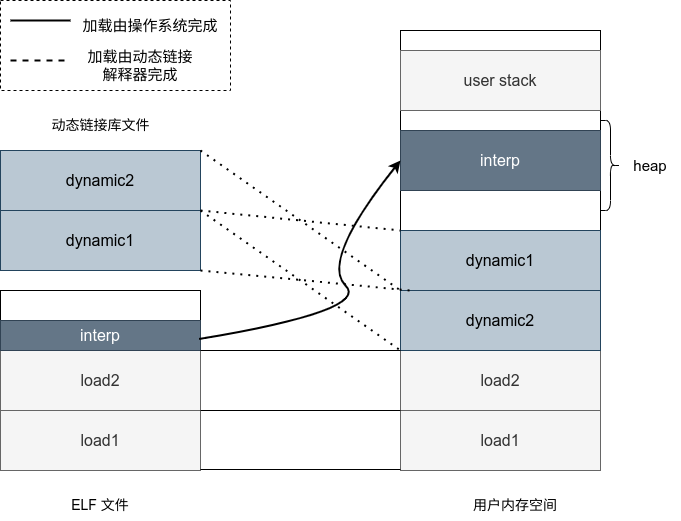
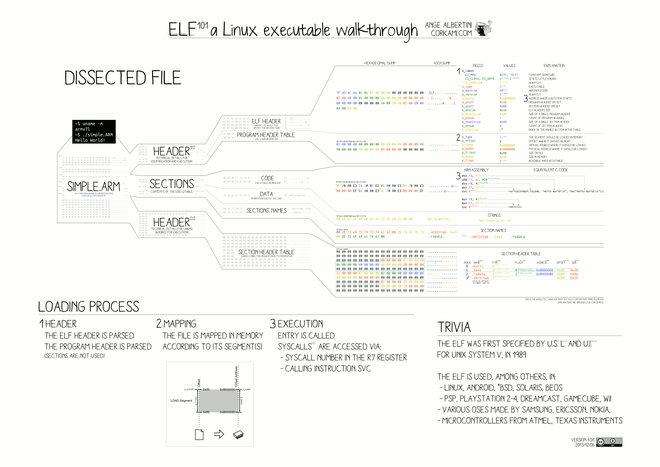

# Dynamic 动态链接

## 需求

动态链接说的是将程序使用到的部分函数库处理成动态链接库，只有在运行需要的时候才加载入内存，这样可以减小可执行文件的大小，增强程序的可拓展性，此外还有诸多优点。

对于操作系统而言，并没有那么复杂，它并不需要亲自完成上述的操作，它只需要在加载存在动态链接的程序的时候，除了加载程序本身外，再加载一个动态链接解释器即可，程序执行的时候将控制权交给动态链接指示器即可。

也就是如示意图所示：



## 实现



> 另外突然想到一句话，记在这里“section 是从编译角度出发的，segment 是从加载角度出发的，具有相同加载属性的 section 聚集成了一个 segment”。

### 寻找动态链接解释器

使用了动态链接的程序，他的可执行文件中有一个 Segment 的名字是 `ENTERP` ，这个段是一个字符串路径，就是动态解释器的路径。

### 加载动态链接解释器

动态链接解释器本身也是一个动态链接库，静态加载时用到的“根据 elf 文件中记载的绝对偏移“完成加载的方法是不适用的，因为动态链接的 elf 文件中记载的偏移是相对偏移是无法直接指导加载的。我们需要手动为他选择一片地址空间，我们选择了 brk 堆空间加载动态链接器。

在加载的时候也没有采用一个一个 segment 加载的方式，而是先将所有 load segment 占据的空间分配出来，然后再在这些空间上映射上加载段，这么做的原因不得而知，可能适合堆的实现特性有关。

### 初始化进程栈

动态链接器需要更加规范的参数，这些参数是通过用户栈来传递的，根据要求，我们需要将进程栈处理成如下格式：

```
argc
argv[1]
argv[2]
NULL
envp[1]
envp[2]
NULL
AT_HWCAP ELF_HWCAP
AT_PAGESZ ELF_EXEC_PAGESIZE
... ...
NULL NULL
"argv1"
"argv2"
"env1=a"
"LD_LIBRARY_PATH=/"
```

其中辅助数组的含义是

| 条目      | 含义                                                         | 取值                                                         |
| --------- | ------------------------------------------------------------ | ------------------------------------------------------------ |
| AT_HWCAP  | RISC-V CPU的扩展功能信息                                     | 原则上应该从CPU中读取特定的寄存器，这里默认不启用任何CPU扩展，所以该位设为0 |
| AT_PAGESZ | 页面大小                                                     | 与虚拟内存的页面大小一致，设为PAGE_SIZE (4096)               |
| AT_PHDR   | 段表(Segment Table)在虚拟内存中的地址                        | 在加载**原**程序的时候获得，它位于**原**程序的某个段中。我们需要遍历所有的段，看一下哪个段在文件中的范围覆盖了段表，并计算段表在虚拟内存中的地址。 |
| AT_PHENT  | 每个段头的大小                                               | 32位与64位不同，我们采用64位的操作系统，所以是64位程序的程序头的大小 `sizeof(Phdr)` |
| AT_PHNUM  | 段的数量                                                     | 由程序头获得                                                 |
| AT_BASE   | 动态链接器被加载到的基地址                                   | 在加载时由操作系统的 `mmap` 决定，将 `mmap` 返回的地址传给动态链接器 |
| AT_ENTRY  | 原程序的入口                                                 | 由程序头获得                                                 |
| AT_SECURE | 是否启用安全模式。非安全模式下动态链接器会访问环境变量作为查找.so文件的路径，在安全模式下不会访问环境变量。 | 我们使用非安全模式启动该程序，并设置 `LD_LIBRARY_PATH` 这个环境变量为根目录 `LD_LIBRARY_PATH='/'` |
| AT_RANDOM | 16字节随机数的地址，作为libc随机数的种子                     | 将 `16byte` 的随机数存在栈上                                 |
| AT_EXECFN | 传递给动态连接器该程序的名称，用户态地址                     | `ustack[1]` ，即为 `argv[0]` 指向的位置，也就是程序的名称    |

## 参考资料

- 《程序员的自我修养：加载，链接与库》
- [elf wiki](https://en.wikipedia.org/wiki/Executable_and_Linkable_Format)
- 往年代码