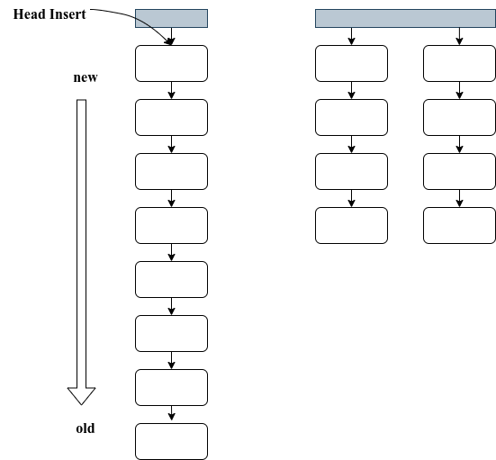

# Extern Cache

## Bio

外存的 IO 带宽要远低于内存的带宽，所以我们可以利用局部性原理，将一部分内存当做外存的 cache，缓存外存 block。缓冲块结构如下所示：

```c
typedef struct Buf
{
    int valid;        // valid == 1 时表示此时 buffer 中含有正确的缓存内容， 等于 0 表示需要重新到硬盘中读取
    int disk;         // 当 disk == 1，表示内容正在从磁盘上读取，读取完后设置为 0。
    int dev;          // 应该是说 (device, blockno) 这个二元组标志了一个块
    u32 blockno;      // 块号，所谓的 block 似乎应该对应一个 buffer
    u32 refcnt;       // 被使用的次数
    struct Buf *prev; // LRU cache list
    struct Buf *next;
    u8 data[BUFFER_SIZE];
} Buf;
```

## LRU

有了外存缓存块后，需要考虑如何检索和逐出缓冲块。我们可以用链表配合头插法实现 LRU 策略，当使用到一个缓冲块的时候，就将其用头插法插入到链表中。

这样在检索的时候，离头结点越近的缓冲块，就是最近使用的缓冲块，检索速度最快，这样可以利用局部性原理，提高缓存的效率。

其实现如下图的左半部分所示：



但是可以注意到，如果内存中只维护一个链表，那么检索效率并不高，因为链表的检索效率是 $O(n)$ 。所以可以考虑根据 blockno 对不同的缓冲块进行分组后再链表，这样可以减少链表长度，提高检索效率。

## Write Back

如果为了一致性，采用写穿策略（也就是写不缓存），那么就过于保守了，会大大影响 IO 性能。

可以考虑给链表设置一个最大长度，然后只有在链表长度超过限度后，才将链表尾部的缓存写回。

采用这种策略时，注意要在关机时将缓存写回，这样才能维护一致性。