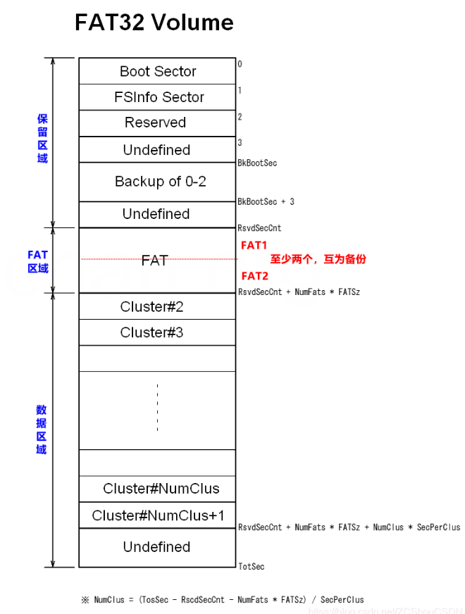
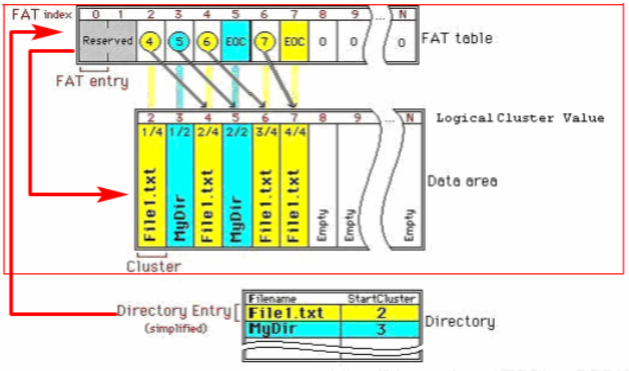
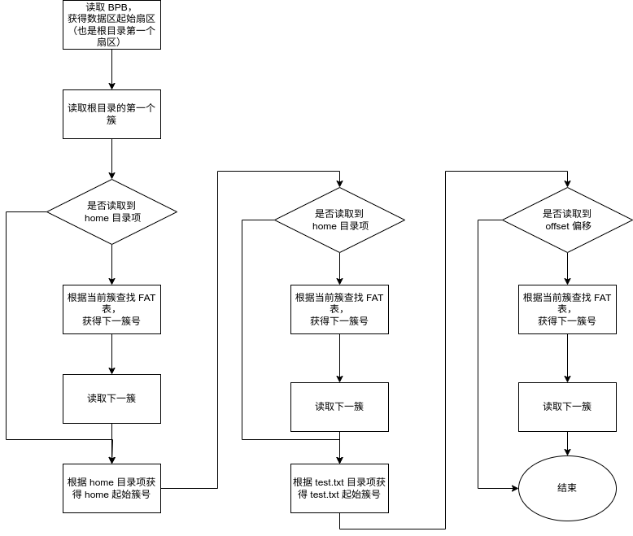
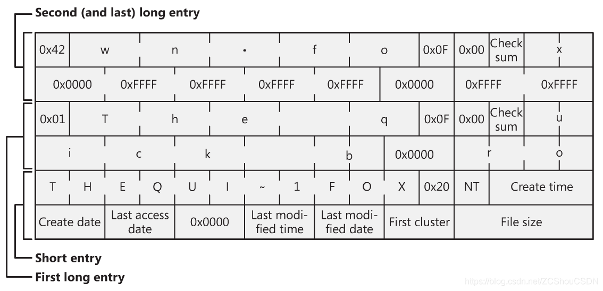

# FAT32

## 保留区

### BPB

在 FAT 没有明确的 SuperBlock 的概念，发挥和 SuperBlock 概念类似的是 BPB（BIOS Parameter Block）。在 FAT卷（“卷”是“文件系统”的同义词）中第一个扇区是 Boot Sector（引导扇区），上面的数据统称为 Boot Record（引导记录），引导记录的一部分是 BPB，这个部分并没有从头开始，而是在 BR 的中间部分，当我们阐述偏移量的时候，是相对于 Boot Sector 的首地址的偏移，而不是 BPB 的首地址的偏移。

BPB 中存储着关于 FAT 卷的配置参数，比较有用的记录如下：

| field      | 偏移（字节） | 大小（字节） | 解释                                     |
| ---------- | ------ | ------ | -------------------------------------- |
| bytsPerSec | 11     | 2      | 一个扇区的字节数，一般是 512                       |
| secPerClus | 13     | 1      | 一个簇的扇区数。需要是 2 的幂次                      |
| rsvdSecCnt | 14     | 2      | 保留区域的总扇区数，保留区域是 FAT 卷的第一个区域            |
| numFATs    | 16     | 1      | FAT 表的个数，恒为 2                          |
| totSec     | 32     | 4      | FAT 卷的扇区总数。 该值是包括卷的所有三个区域在内的扇区总数       |
| FATsz      | 36     | 4      | 每个 FAT 的扇区数                            |
| rootClus   | 44     | 4      | 根目录（也就是数据区域）的第一个簇的编号。 它通常设置为 2，即卷的第一个簇 |

### 计算参数

根据 BPB 中记录的参数，我们可以计算出一些有用的参数，方便之后的计算。需要注意这些参数都并不存在 FAT 系统内。

首先介绍 FAT 的结构



**FAT 区：**

因为 FAT 区域紧邻着保留区域，所以 FAT 的起始扇区号是保留区域的大小

```c
fatBeginSec = bpb.rsvdSecCnt;
```

而 FAT 区域的大小（以扇区为单位）是 FAT 表的数量和每个 FAT 表的扇区数

```c
FatSectors = bpb.FATSz * bpb.numFATs;
```

**数据区：**

数据区在 FAT 区域之后，所以 FAT 的起始扇区号是 FAT 起始扇区与 FAT 区域大小的加和

```c
dataBeginSec = fatBeginSec + FatSectors = bpb.rsvdSecCnt + bpb.FATSz * bpb.numFATs;
```

数据区的大小（以扇区为单位）是总的扇区数减去前面两个区域的扇区数，也就是减去数据区的起始扇区

```c
dataSectors = bpb.totSec - dataBeginSec;
```


## FAT 表

### 簇

FAT 是用簇来管理**数据区**的（但是对于保留区和 FAT 表，依然是用扇区进行管理的）。 簇是由多个连续的扇区组成的，我们为某个文件分配数据区的一片区域时，只能分配一个簇而不能分配一个扇区或者一个字节，这是因为扇区或者字节这样的单位过于细小，对其逐个编号十分浪费空间。

簇被组织成链表的形式，每个文件或者目录都对应一个链表簇。链表的 next 域被记录在 FAT 表中。文件通过目录项记录自己的起始簇号（也就是链表头）。

其结构如图所示：



### FAT 表项

FAT 表项是 FAT 表的组成成分，FAT 表是一个 FAT 表项的一维数组，一个 FAT 表条目对应数据区域的一个簇，比如说第 33 个簇，他对应的表项就是 `FAT[33]` 。这个表项有以下几种可能的值：

- 链中下一个簇的地址
  
- 一个特殊的簇链结束符（EOC，End Of Cluster-chain，或称 End Of Chain）符号指示链的结束
  
- 一个特殊的符号标示坏簇
  
- 一个特殊的符号标示保留簇
  
- 0 来表示空闲簇
  


## 数据区

### 根目录

在 FAT 文件系统中，目录是一种特殊的文件，同样记录在磁盘上。目录的本质是一个“**目录条目数组**”，一个或者多个目录条目（一个目录条目可能无法表示全部信息）对应该目录下的一个文件。

每个（或者每组）目录条目中记录着文件的属性、起始簇号和时间戳。我们可以根据起始簇号去查询 FAT 表，然后就可以查询到文件的所有簇（以链表形式），进而读取文件的所有内容。

根目录就是数据区的第一个文件，通过读取这个文件，就可以获得根目录下希望访问的文件，通过这个文件的起始簇号，查找 FAT 表，就可以获得文件内容。这个过程中 FAT 的三个区域均有参与，以查找 `/home/test.txt` 的 `offset` 偏移后的内容为例，其流程如下：



### 目录项

目录项是一个 32 bit 的元素，用来表示目录里的文件。它分为两种：短目录项（short name entry, sne）和长目录项（long name entry, lne），一个文件可以对应 1 个 sne，或者对应 1 个 sne 和多个 lne（这种情况发生在文件名比较长的情况，无法用一个 sne 表示）。

目录项的结构如下：

```c
/**
 * @brief 短文件名目录项
 *
 */
typedef struct short_name_entry
{
    // name[0] 的值如果是 0xe5 EMPTY_ENTRY 和 0x00 END_OF_ENTRY, 是有特殊含义的
    // 它和 LNE 的 order 字符在同一个内存位置
    char name[CHAR_SHORT_NAME]; // 文件名，最多 11 个字符，如果文件名不足 11 个字符，则用空格填充
    u8 attr;                    // 文件属性，用于标识该目录项对应的是文件还是目录
    u8 _nt_res;                 // 保留字段，未使用
    u8 _crt_time_tenth;
    u16 _crt_time;
    u16 _crt_date;
    u16 _lst_acce_date;
    u16 fst_clus_hi; // 文件起始簇号的高 16 位
    u16 _lst_wrt_time;
    u16 _lst_wrt_date;
    u16 fst_clus_lo; // 文件起始簇号的低 16 位
    u32 file_size;   // 文件大小，以字节为单位
} __attribute__((packed, aligned(4))) short_name_entry_t;

/**
 * @brief 长文件名目录项
 *
 */
typedef struct long_name_entry
{
    u8 order;       // 长文件名目录项的顺序号，从 1 开始递增
    wchar name1[5]; // 文件名的前 5 个字符，以 Unicode 编码方式存储
    // 这里是第 11 个字节，和 SNE 的第 11 个字节相同
    u8 attr;          // 文件属性，用于标识该目录项对应的是文件还是目录
    u8 _type;         // 文件名类型，用于标识该目录项是长文件名还是短文件名
    u8 checksum;      // 校验和，用于检测长文件名目录项是否被修改
    wchar name2[6];   // 文件名的中间 6 个字符，以 Unicode 编码方式存储
    u16 _fst_clus_lo; // 文件起始簇号的低 16 位
    wchar name3[2];   // 文件名后两个字符
} __attribute__((packed, aligned(4))) long_name_entry_t;

/**
 * @brief 是联合体！可以是 short_name_entry，也可以是 long_name_entry
 * - 短文件名目录项（`sne`）：用于存储文件的短文件名，最多 11 个字符，通常用于 DOS 和 Windows 系统下的文件命名。
 *   短文件名目录项的结构比较简单，只包含了文件名、文件属性、时间戳、起始簇号和文件大小等基本信息。
 * - 长文件名目录项（`lne`）：用于存储文件的长文件名，最多 255 个字符，通常用于支持 Unicode 字符集的文件系统中。
 * 长文件名目录项的结构比较复杂，包含了文件名的各个部分、文件属性、校验和和起始簇号等信息。
 */
typedef union dentry
{
    short_name_entry_t sne;
    long_name_entry_t lne;
} Dentry;
```

**短目录项**

| Field name 字段名 | Offset 偏移 | Size 大小 | Description 描述                                             |
| ----------------- | ----------- | --------- | ------------------------------------------------------------ |
| DIR_Name          | 0           | 11        | 对象的短文件名（sne）。                                      |
| DIR_Attr          | 11          | 1         | 文件属性，由以下标志组合而成。 高 2 位保留，必须为零。 0x01: ATTR_READ_ONLY (Read-only) 0x02: ATTR_HIDDEN (Hidden) 0x04: ATTR_SYSTEM (System) 0x08: ATTR_VOLUME_ID (Volume label) 0x10: ATTR_DIRECTORY (Directory) 0x20: ATTR_ARCHIVE (Archive) 0x0F: ATTR_LONG_FILE_NAME (lne entry) |
| DIR_NTRes         | 12          | 1         | 可选标志。                                                   |
| DIR_CrtTimeTenth  | 13          | 1         | 可选的亚秒信息对应于 DIR_CrtTime。 DIR_CrtTime 的时间分辨率为2秒，因此该字段给出亚秒计数，其有效值范围为 0 到 199，单位为 10 毫秒。 如果不支持，请设置为零，之后不要更改。 |
| DIR_CrtTime       | 14          | 2         | 可选的文件创建时间。 如果不支持，请设置为零，之后不要更改。  |
| DIR_CrtDate       | 16          | 2         | 可选的文件创建日期。 如果不支持，请设置为零，之后不要更改。  |
| DIR_LstAccDate    | 18          | 2         | 可选的上次访问日期。 没有关于上次访问时间的时间信息，因此最后访问时间的分辨率为1天。 如果不支持，请设置为零，之后不要更改。 |
| DIR_FstClusHI     | 20          | 2         | 起始簇号的高 16 位。 FAT12/16 卷始终为零。                   |
| DIR_WrtTime       | 22          | 2         | 对文件进行任何更改时的上次时间（通常在关闭时）。             |
| DIR_WrtDate       | 24          | 2         | 对文件进行任何更改时的最后数据（通常在关闭时）。             |
| DIR_FstClusLO     | 26          | 2         | 起始簇号的低 16 位。 如果文件大小为零，则始终为零。          |
| DIR_FileSize      | 28          | 4         | 文件大小，以字节为单位。 当它是目录时不使用，值必须始终为零。 |

`DIR_Name` 字段的第一个字节 `DIR_Name[0]` 是一个重要数据，用于指示目录条目的状态。当值为 `0xE5` 时，表示该条目未被使用（新分配可用）。 当值为 `0x00` 时，表示该条目未被使用（与 `0xE5` 相同），此外，在此之后没有分配的条目（在此之后的所有条目中的所有 `DIR_Name[0]` 也被设置到 0）。 `DIR_Name[0]` 中的任何其他值表示正在使用的条目。 标题字符为 `0xE5` 的文件名有一个例外。 在这种情况下，改为设置 `0x05`。

`DIR_Name` 字段是一个 11 字节的字符串，分为两部分，正文和扩展。 文件名以 8 字节正文 + 3字节扩展名存储。 在目录条目上，文件名中用于分隔正文和扩展名的句点要删除。 如果名称的任何部分与该部分不匹配，则该部分中的剩余字节用空格(0x20)填充。文件名使用的代码页取决于系统。如图所示：


以下是一些示例：

```shell
FileName           DIR_Name[]       Description
"FILENAME.TXT"    "FILENAMETXT"     Dot is removed.
"DOG.JPG"         "DOG     JPG"     Each part is padded with spaces.
"file.txt"        "FILE    TXT"     Each character is upper-case converted.
"蜃気楼.JPG"      "・気楼  JPG"     The first byte of "蜃", 0xE5, is replaced with 0x05
"NOEXT"           "NOEXT      "     No extension
".cnf"                              (illegal) Any name without body is not allowed
"new file.txt"                      (illegal) Space is not allowed.
"file[1].2+2"                       (illegal) [ ] + are not allowed.
"longext.jpeg"                      (illegal) Out of 8.3 format.
"two.dots.txt"                      (illegal) Out of 8.3 format.
```

**长目录：**

lne 始终与相应的 sne 相关联，以便将 lne 添加到文件中。 lne 从不独立于 sne 存在。 因此，每个文件只有 sne 或者 sne 和 lne。 lne 条目只包含其中的名称信息，而没有关于该文件的任何其他信息。 如果存在没有与 sne 条目关联的 lne 条目，则这种杂散 lne 条目无效并被视为垃圾。 这是为了向后兼容旧系统。 如果为文件指定了lne，则 lne 是文件的主要名称，sne 是另一种选择。

| Location | First byte | Name field    | Attribute | Content                   |
| -------- | ---------- | ------------- | --------- | ------------------------- |
| DIR[N-3] | 0x43       | ary.pdf       | –VSHR     | LFN 3rd part (lfn[26…38]) |
| DIR[N-2] | 0x02       | d System Summ | –VSHR     | LFN 2nd part (lfn[13…25]) |
| DIR[N-1] | 0x01       | MultiMediaCar | –VSHR     | LFN 1st part (lfn[0…12])  |
| DIR[N]   | ‘M’        | MULTIM~1PDF   | A-----    | Associated SFN entry      |

此外，校验和用于确保 LFN 和 SFN 之间的相关性。 每个 LFN 条目都具有 LDIR_Chksum 中相关 SFN 的校验和。 校验和在下面显示的算法中生成。

```c
static u8 calChecksum(uchar *shortname)
{
    u8 sum = 0;
    for (int i = CHAR_SHORT_NAME; i != 0; i--)
    {
        sum = ((sum & 1) ? 0x80 : 0) + (sum >> 1) + *shortname++;
    }
    return sum;
}
```

sne 和 lne 配合如图：


