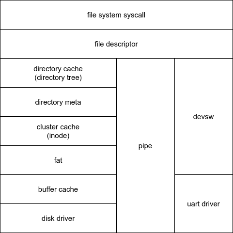
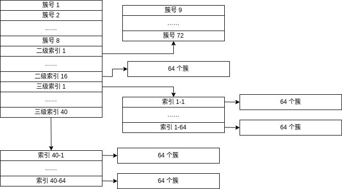

# File System

## Overview

文件系统是一个层次结构，结构如下所示：



在 linux “一切皆文件”的设计思想下，无论是文件、管道还是设备，都可以用统一的文件描述符来形容，同时具有读写接口。为了达到这一目的，需要分别实现后再用统一的接口层为应用程序提供服务。

最顶层是系统调用层，为系统调用提供具体的实现。第二层是文件描述层，这层主要是提供不同实现的统一描述，并在系统调用时进行不同部分的分发。第三层在初赛分为了 3 个部分，最左侧是 FAT 文件系统部分，中间是管道部分，最右侧是硬件部分。

FAT 文件系统总共分为 6 层，从底向上，第一层是 `virtio` 驱动层，用于与磁盘沟通；第二层是块缓存层，将读取到的磁盘利用 LRU 策略缓存起来，避免了频繁的磁盘沟通。第三层是 fat 层，提供了对磁盘 FAT 文件系统的基本读写功能。第四层是簇缓存层，因为 FAT 组织簇时呈现链表形式，对于非顺序的读写（比如对于某个目录项）支持并不好，此层提供了对于簇号的缓存。第五层是目录元数据层，可以看做 FAT 文件系统在内存中的抽象。第六层是目录缓冲层，避免了对目录操作时频繁的写回。

对于管道的实现，是在内存中划分一块贡献内存，并从文件的角度进行描述。对于设备，初赛只涉及串口驱动，将读写函数与文件的读写功能绑定即可。

## FAT FS

### Disk Driver

主要文件是 `./kernel/driver/virio.c` 。

我们的磁盘驱动是 virtio 驱动。此层提供了与磁盘沟通的能力。这个部分主要在[virtio](./virtio.md)这篇文档中有讲述。

### Buffer Cache

主要文件是 `./kernel/fs/bio.d`。

因为磁盘读写十分耗时，所以有必要将读出的磁盘块缓存到内存中，这样可以减少磁盘读写。

此层的数据结构是一个缓冲块双向链表，每个缓存块 `Buf` 的结构如下所示

```c
typedef struct Buf
{
    int valid;        // valid == 1 时表示此时 buffer 中含有正确的缓存内容， 等于 0 表示需要重新到硬盘中读取
    int disk;         // 当 disk == 1，表示内容正在从磁盘上读取，读取完后设置为 0。
    int dev;          // 应该是说 (device, blockno) 这个二元组标志了一个块
    u32 blockno;      // 块号，所谓的 block 似乎应该对应一个 buffer
    u32 refcnt;       // 被使用的次数
    struct Buf *prev; // LRU cache list
    struct Buf *next;
    u8 data[BUFFER_SIZE];
} Buf;
```

我们采用 LRU 作为缓存的换出策略，为了实现这个，我们需要做出如下实现：

当查找缓冲块的时候应当顺序遍历链表

```c
// 沿链表顺序查找是否有 (dev, blockno)  对应的节点
for (b = bcache.head.next; b != &bcache.head; b = b->next)
{
    if (b->dev == dev && b->blockno == blockno)
    {
        b->refcnt++;
        return b;
    }
}
```

在分配时逆序遍历链表

```c
// 如果没有被缓存
// 那么逆序遍历链表，找出一个空的 Buf，这是 LRU 的一种体现
// 越靠后说明其变为 ref == 0 的时间越长
for (b = bcache.head.prev; b != &bcache.head; b = b->prev)
{
    // 找到一个没有被引用的，等级 (dev, blockno) 二元组
    if (b->refcnt == 0)
    {
        b->dev = dev;
        b->blockno = blockno;
        b->valid = 0;
        b->refcnt = 1;
        return b;
    }
}
```

在换出时头部插入

```c
// 这是 LRU 的一部分，越靠前表示 ref == 0 的时间越近
if (b->refcnt == 0)
{
    b->next->prev = b->prev;
    b->prev->next = b->next;
    b->next = bcache.head.next;
    b->prev = &bcache.head;
    bcache.head.next->prev = b;
    bcache.head.next = b;
}
```

### FAT

主要文件在 `/kernel/fs/fat.c` 中

本文主要提供 fat 文件系统的实现，其基础理论在[fat.md](./fat.md)中介绍，这层的功能主要包括：

- 超级块的读写和 FAT 的初始化
- FAT 表的读写
- FAT 数据区簇操作

对于文件系统的初始化，主要依靠读取超级块的参数并计算获得，部分代码如下所示：

```c
// 构造 superblock
fs->superBlock.BPB.bytsPerSec = *(u16 *)(b->data + 11);
fs->superBlock.BPB.secPerClus = *(b->data + 13);
fs->superBlock.BPB.rsvdSecCnt = *(u16 *)(b->data + 14);
fs->superBlock.BPB.numFATs = *(b->data + 16);
fs->superBlock.BPB.totSec = *(u16 *)(b->data + 19);
if (fs->superBlock.BPB.totSec == 0)
{
    fs->superBlock.BPB.totSec = *(u32 *)(b->data + 32);
}
fs->superBlock.BPB.FATsz = *(u32 *)(b->data + 36);
fs->superBlock.BPB.rootClus = *(u32 *)(b->data + 44);
fs->superBlock.firstDataSec = fs->superBlock.BPB.rsvdSecCnt + fs->superBlock.BPB.numFATs * fs->superBlock.BPB.FATsz;
fs->superBlock.dataSecCnt = fs->superBlock.BPB.totSec - fs->superBlock.firstDataSec;
fs->superBlock.dataClusCnt = fs->superBlock.dataSecCnt / fs->superBlock.BPB.secPerClus;
fs->superBlock.bytsPerClus = fs->superBlock.BPB.secPerClus * fs->superBlock.BPB.bytsPerSec;
```

对于 FAT 表的读写，主要是为了获得簇链表，具体实现如下

```c
/**
 * @brief 读取 cluster 在 FAT 表中的条目项内容
 *
 * @param fs 文件系统
 * @param cluster 簇号
 * @return u32 条目项内容，一般是下一个簇号
 */
static u32 readFat(FileSystem *fs, u32 cluster)
{
    // cluster 过大
    if (cluster >= FAT32_EOC)
    {
        return cluster;
    }
    // cluster 过大
    if (cluster > fs->superBlock.dataClusCnt + 1)
    {
        return 0;
    }
    // 计算对应的 fat 表的 sector
    u32 fatSec = fatSecOfClus(fs, cluster, 1);
    // TODO:here should be a cache layer for FAT table, but not implemented yet.
    // 读入这个 FAT 表扇区
    Buf *b = fs->read(fs, fatSec);
    // 通过偏移量读取出 cluster 对应的条目项，里面的内容是下一个簇号
    u32 nextClus = *(u32 *)(b->data + fatOffsetOfClus(fs, cluster));
    brelse(b);
    return nextClus;
}

/**
 * @brief 写入 content 到 cluster 在 FAT 表中的条目项
 *
 * @param fs 文件系统
 * @param cluster 簇号
 * @param content 写入内容
 * @return int 0 为成功，-1 为失败
 */
static int writeFat(FileSystem *fs, u32 cluster, u32 content)
{
    if (cluster > fs->superBlock.dataClusCnt + 1)
    {
        return -1;
    }
    u32 fatSec = fatSecOfClus(fs, cluster, 1);
    Buf *b = fs->read(fs, fatSec);
    u32 off = fatOffsetOfClus(fs, cluster);
    *(u32 *)(b->data + off) = content;
    bwrite(b);
    brelse(b);
    return 0;
}
```

对于簇操作，具有很多种，除了基础的读写簇外，有一个重定位簇操作，需要在读写簇前进行重定位操作。这是因为我们读写的时候一般用 `offset` 偏移量，但是读写操作的是簇，读写过程中当前簇可能会发生变化，所以需要重定位。

### Cluster Optimize

这个部分主要在 `/kernel/fs/fat.c,/kernel/fs/inode.c ` 中。

关于簇的优化分为两个部分，一个是对于通过文件偏移量获得簇号，原有的方法是顺序遍历链表，我们从 inode 中受到启发，用类似的方式缓存了文件簇索引（也就是这是文件的第几个簇）与绝对簇号间的映射。另一个是对于空闲簇的分配，原有方法是顺序遍历 FAT 表进行查找，我们用一个位图来记录簇是否被分配，这样在内存可以以 $O(1)$ 速度查找。

inode 的结构如下：



每个文件结构体中有一个 `int inode[64]` ，每个 Inode 中记录了 64 个 32 位的整数。前 8 个整数直接记录该位置的簇号，之后的 16 个整数记录一个 Inode 资源池的索引，表示二级 Inode。剩余的 40 个整数表示三级 Inode 索引。

Cluster BitMap 可以避免簇的顺序遍历分配，在初始化文件系统的时候，需要导入 FAT 表并更新位图，才能获得之后查询的便利，实现如下：

```c
    // 遍历读取 FAT 表的所有扇区，本质是遍历所有的 FAT 表项，并根据是否为 0 标记 bitmap
    for (u32 i = 0; i < fs->superBlock.BPB.FATsz; i++, sec++)
    {
        b = fs->read(fs, sec);
        CNX_DEBUG("sec: %d\n", i);
        for (u32 j = 0; j < entryPerSec; j++)
        {
            if (((u32 *)(b->data))[j])
            {
                int no = i * entryPerSec + j;
                clusterBitmap[no >> 6] |= (1UL << (no & 63));
            }
        }
        brelse(b);
    }
```

### DirMeta

这个部分主要在 `/kernel/fs/dirmeta.c,/kernel/fs/fat.c ` 中。

`DirMeta` 是 fs 中的核心结构，本质是对于 fat 文件系统中的目录项结构的内存实现，其结构如下

```c
typedef struct DirMeta
{
    char filename[FAT32_MAX_FILENAME + 1];
    u8 attribute;
    u32 firstClus; // 文件的第一簇
    u32 fileSize;  // 文件的字节大小

    u32 curClus;         // 文件的当前簇
    u32 inodeMaxCluster; // 已经缓存过的 cluster 的数量
    u32 clusCnt;         // 簇的数量
    Inode inode;         // 用来检索已经用过的簇

    u8 reserve; // 保留字段，主要用于指示该文件是否是链接
    /* for OS */
    FileSystem *fileSystem;
    enum
    {
        ZERO = 10,
        OSRELEASE = 12,
        NONE = 15
    } dev;
    FileSystem *head;            // 这个属性只有 mountPathMeta 拥有，对应所有被挂载在当前路径上的文件系统链表的头结点（也就是最近挂载的文件系统）
    u32 off;                     // 这个目录项在目录中偏移（单位应该是字节）
    struct DirMeta *parent;      // 父目录
    struct DirMeta *nextBrother; // 用于构造链表
    struct DirMeta *firstChild;
} DirMeta;
```

其中 `/* for OS */` 以上的部分和目录项结构体基本一致，而其下的部分则是为了 OS 的优化或者功能实现的辅助结构。

因为目录系统和文件的查找有很大的关系，因为链表结构，所以查找耗时较多（因为文件的查找并不是顺序的）。可以将目录系统存入内存中，并用树形结构表示，提高了查找的效率。需要在初始化的时候导入整个目录系统，在关机时将内存中的目录系统导出到磁盘上。

## Syscall

### 统一抽象

按照 linux 的“一切皆文件” 的思想，文件、设备和管道都需要进行统一的描述，在实际实现的时候，是通过分用的方式实现的，比如说对于文件的读写，即如下所示

```c
switch (f->type)
{
    case FD_PIPE:
        r = pipeRead(f->pipe, isUser, addr, n);
        break;
    case FD_DEVICE:
        if (f->major < 0 || f->major >= NDEV || !devsw[f->major].read)
            return -1;
        r = devsw[f->major].read(isUser, addr, 0, n);
        break;
    case FD_ENTRY:
        if ((r = metaRead(f->meta, isUser, addr, f->off, n)) > 0)
            f->off += r;
        break;
    default:
        panic("fileread");
}
```

### 挂载

挂载一个文件系统镜像。文件系统未被挂载前，是以一个镜像文件的形式(image)存在于现有文件系统中的。我们需要将它挂载到现有文件系统的某个挂载点（是一个目录）上去。

挂载可能会发生多个镜像挂载到同一个挂载点上的现象，这个时候需要利用一个头插法链表来记录某个挂载点上的所有镜像。此时挂载点应当呈现最近挂载的镜像的内容。卸载同样有重复挂载的问题，如果仅仅是卸载完最近挂载的镜像，挂载点的内容应该是较早挂载的镜像的内容。卸载必须按照逆向挂载顺序操作。

同时，被挂载的文件系统的 `read` 设置为 `mountBlockRead`。通过该函数读一个磁盘块，如果文件系统镜像为设备，则调用设备的读函数；如果为文件，则调用 `metaRead` 在该文件所在的文件系统中读该文件。

### 链接

新建一个文件，类型为链接，内容是链接的绝对路径。在 `lookup_path` 的时候，如果是链接文件，则跳转该文件记录的真实文件。