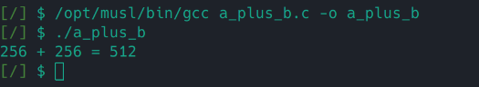
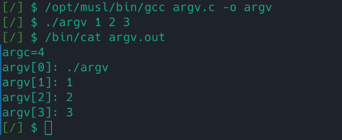
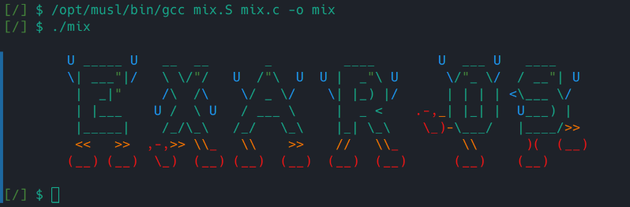

# Musl-libc-toolchain

## 简介

[Musl-libc-toolchain](https://musl.cc/) 是一个小型可靠的预构建 GCC 工具链，适用于多种架构。

我们的内核支持 riscv64-linux-musl-native 运行

## 文件结构

```
/
├── a_plus_b.c	// test 0 source code
├── argv.c		// test 1 source code
├── libc.so		// dynamic linking file
├── mix.c		// test 2 source code
├── mix.S		// test 2 source code
└── opt
    └── musl	// musl-libc-toolchain root
        ├── bin
		│	├── gcc
		│	├── cpp
		│	├── as
		│	├── ld
		│	└── ...
        ├── include
        ├── lib
        ├── libexec/gcc/riscv64-linux-musl/10.2.1 
		│	├── cc1
		│	└── ...
        ├── riscv64-linux-musl
        └── share
```

## 编译过程

`gcc` 对源代码进行编译的过程，本质上是对 `cpp`， `cc1`, `as`, `ld` 等程序的调用过程。

为了让 `gcc` 成功调用这些程序，只需要额外将 `/opt/musl/bin` 加入到环境变量 `PATH` 中

## 测试

为了验证 Musl-libc-toolchain 能正常工作，
我们选择编写了几个比较有代表性的程序，
分别通过静态和动态链接验证程序是否能正确编译和执行。

### a_plus_b

初步测试输入输出

```c
/* a_plus_b.c */
#include <stdio.h>

int main()
{
    int a, b;
    scanf("%d%d", &a, &b);
    printf("%d + %d = %d\n", a, b, a + b);
    return 0;
}
```

测试结果如下



成功输出计算结果，测试通过

### argv

测试文件读写以及程序参数

```c
/* argv.c */
#include <stdio.h>
#include <stdlib.h>

int main(int argc, char **argv)
{
    int a, b;
    FILE *file = fopen("argv.out", "w");
    if (file == NULL)
    {
        printf("No such file!\n");
        exit(0);
    }
    fprintf(file, "argc=%d\n", argc);
    for (int i = 0; i < argc; i++)
    {
        fprintf(file, "argv[%d]: %s\n", i, argv[i]);
    }
    fclose(file);
    return 0;
}
```

测试结果如下



成功输出参数到文件，测试通过

### mix

汇编，c 代码混合编译测试，验证程序是否正确链接

```c
/* mix.c */
#include <stdio.h>
char *banner =
    "\n\t\033[34mU\033[0m _____ \033[34mU\033[0m   __  __       _         ____        \033[34mU\033[0m  ___ \033[34mU\033[0m   ____     \n"
    "\t\033[34m\\\033[0m| ___\033[32m\"\033[0m|\033[34m/\033[0m   \\ \\/\033[32m\"\033[0m/   \033[34mU\033[0m  /\033[32m\"\033[0m\\  \033[34mU\033[0m  \033[34mU\033[0m |  _\033[32m\"\033[0m\\ \033[34mU\033[0m      \033[34m\\\033[0m/\033[32m\"\033[0m_ \\\033[34m/\033[0m  / __\033[32m\"\033[0m| \033[34mU\033[0m  \n"
    "\t |  _|\033[32m\"\033[0m     \033[34m/\033[0m\\  /\033[34m\\\033[0m    \033[34m\\\033[0m/ _ \\\033[34m/\033[0m    \033[34m\\\033[0m| |_) |\033[34m/\033[0m      | | | | \033[34m<\033[0m\\___ \\\033[34m/\033[0m   \n"
    "\t | |___    \033[34mU\033[0m /  \\ \033[34mU\033[0m   / ___ \\     |  _ <    \033[31m.-,\033[33m_\033[0m| |_| |  \033[34mU\033[0m___) |   \n"
    "\t |_____|    /_/\\_\\   /_/   \\_\\    |_| \\_\\    \033[31m\\_)\033[33m-\033[0m\\___/   |____/\033[33m>>\033[0m  \n"
    "\t \033[33m<<   >>  \033[31m,-,\033[33m>> \\\\\033[31m_\033[33m   \\\\    >>    //   \\\\\033[31m_\033[33m        \\\\      \033[31m)(  (__) \n"
    "\t(__) (__)  \\_)  (__) (__)  (__)  (__)  (__)      (__)    (__)\033[0m      \n\n";

int logMain()
{
    printf("%s", banner);
    return 0;
}
```

```c
/* mix.S */
    .text
    .globl main
main:
    jal logMain
    li a7, 93
    ecall
```

测试结果如下



输出了 Exaros banner，测试通过