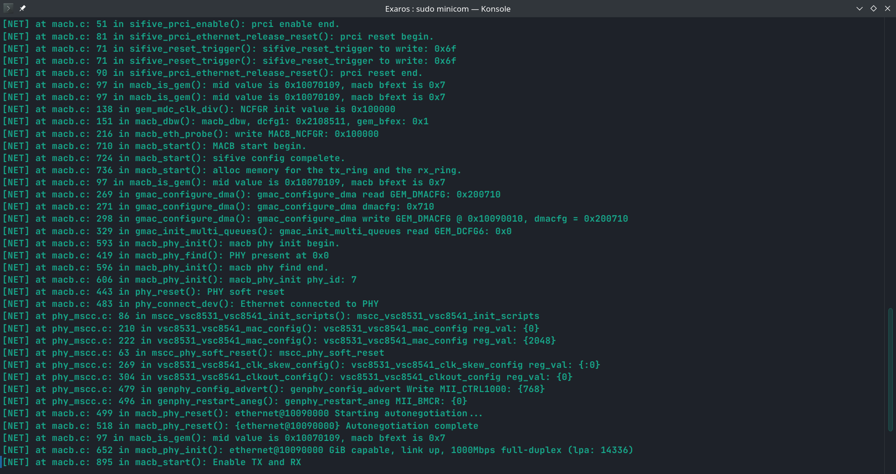
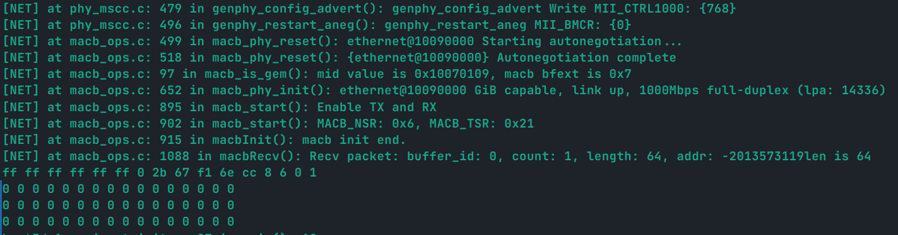
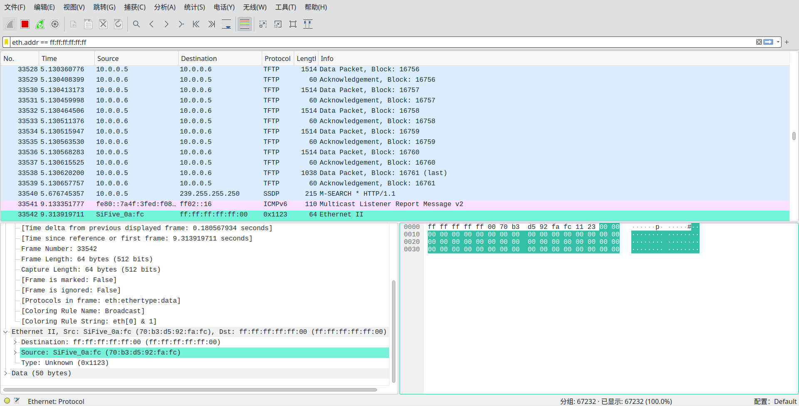

# macb

## uboot 移植

macb 是网卡控制器，他的驱动的撰写我参考了 uboot 的实现，主要分为了两个部分，`macb` 是 soc 内部的，而 `mscc` 是外部控制器。

最后 macb 对外暴露 `macbSend()` 和 `macbRecv()` 两个接口，用于发送和接受数据。

但是尚不明确网卡设备中断。 

## 运行效果

设备的初始化

收包：

发包，并用 wireshark 截获：

