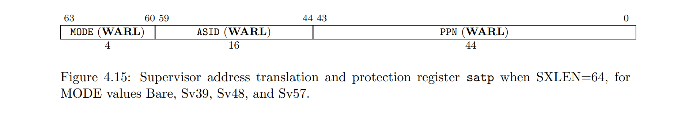
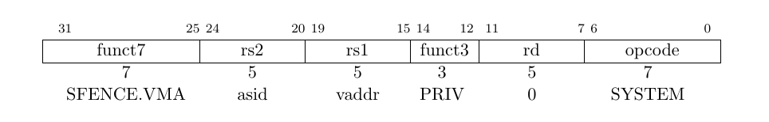

# Memory

## 流程

1. S-MODE 创建内核页表
2. S-MODE 填写 `satp` 寄存器 `MODE` 和一级页表 PPN，开启分页
3. 在 S-MODE 和 U-MODE，MMU 按照 `satp` 自动进行地址翻译和 TLB 填充

## 相关特权级

* M-MODE：无分页（直接映射）
* S-MODE：控制和使用分页
* U-MODE：使用分页

## 相关寄存器

### Supervisor Address Translation and Protection (satp) Register

* `MODE`：当前地址转换方案
* `ASID`：地址空间标识符，用于切换进程页表
* `PPN(Physical Page iNdex)`：根页表 PPN，需要根页表地址 $4K$ 对齐




## 相关命令

### SFENCE.VMA



SFENCE.VMA 用于刷新与地址转换相关的本地硬件缓存

详见 [RISC-V Privileged Architecture](https://github.com/riscv/riscv-isa-manual/releases/download/Priv-v1.12/riscv-privileged-20211203.pdf) 4.2.1

> SFENCE.VMA orders only the local hart’s implicit references to the memory-management data structures.
> Consequently, other harts must be notified separately when the memory-management data structures have been modified. One approach is to use
>  
> 1. a local data fence to ensure local writes are visible globally, then 
> 2. an interprocessor interrupt to the other thread, then
> 3. a local SFENCE.VMA in the interrupt handler of the remote thread, and finally
> 4. signal back to originating thread that operation is complete.
> 
> This is, of course, the RISC-V analog to a TLB shootdown.

SFENCE.VMA 仅仅对当前 hart 的 TLB 缓存生效
在开启多核后，为保证 TLB 一致性，需要实现以下流程：

1. a local data fence（？），保证本地写全局可见（？）（可能就是本地 `SFENCE.VMA` ？）
2. 触发一个处理器间中断（IPI）来通知其他 thread
3. 在其他 thread 的异常处理程序中使用 `SFENCE.VMA`
4. 向原 thread 发送信号，标志刷新完成

关键字: TLB shootdown

> If a hart employs an address-translation cache, that cache must appear to be private to that hart. In particular, the meaning of an ASID is local to a hart; software may choose to use the same ASID to refer to different address spaces on different harts.

ASID 是 local 的，本设计中不考虑 ASID，而是采取全局刷新策略

> The following common situations typically require executing an SFENCE.VMA instruction:
> 
> * When software recycles an ASID (i.e., reassociates it with a different page table), it should first change satp to point to the new page table using the recycled ASID, then execute SFENCE.VMA with rs1=x0 and rs2 set to the recycled ASID. Alternatively, software can execute the same SFENCE.VMA instruction while a different ASID is loaded into satp, provided the next time satp is loaded with the recycled ASID, it is simultaneously loaded with the new page table. 
> * If the implementation does not provide ASIDs, or software chooses to always use ASID 0, then after every satp write, software should execute SFENCE.VMA with rs1=x0. In the common case that no global translations have been modified, rs2 should be set to a register other than x0 but which contains the value zero, so that global translations are not flushed.
> * If software modifies a non-leaf PTE, it should execute SFENCE.VMA with rs1=x0. If any PTE along the traversal path had its G bit set, rs2 must be x0; otherwise, rs2 should be set to the ASID for which the translation is being modified.
> * If software modifies a leaf PTE, it should execute SFENCE.VMA with rs1 set to a virtual address within the page. If any PTE along the traversal path had its G bit set, rs2 must be x0; otherwise, rs2 should be set to the ASID for which the translation is being modified.
> * For the special cases of increasing the permissions on a leaf PTE and changing an invalid PTE to a valid leaf, software may choose to execute the SFENCE.VMA lazily. After modifying the PTE but before executing SFENCE.VMA, either the new or old permissions will be used. In the latter case, a page-fault exception might occur, at which point software should execute SFENCE.VMA in accordance with the previous bullet point.

需要使用 `SFENCE.VMA` 的情况

* 写入 `stap` 后
  * `rs1=x0`
  * `rs2!=x0` 但目标寄存器的值为 0
  * 全局映射不会被刷新
* 修改一个非叶 PTE
  * `rs1=x0`
  * 如果路径上 global 位被设置，则 `rs2=x0`
  * 否则 `rs2!=x0` 但目标寄存器的值为 0
* 修改一个叶 PTE
  * `rs1=va`
  * 如果路径上 global 位被设置，则 `rs2=x0`
  * 否则 `rs2!=x0` 但目标寄存器的值为 0


## 内存布局

### S-MODE 内核地址空间

```
    VA_MAX ---------------->+---------------------------+-------0x7f ffff ffff
                            |       TRAMPOLINE          |       BY2PG
    TRAMPOLINE ------------>+---------------------------+-----------------
                            |                           |
    PHYSICAL_MEMORY_END --->+---------------------------+-------0x8800 0000
                            |                           |
    kernelEnd ------------->+---------------------------+-----------------
                            |       Kernel Data         |
    textEnd --------------->+---------------------------+-----------------
                            |       Kernel Text         |
    BASE_ADDRESS, --------->+---------------------------+-------0x8020 0000
    kernelStart -/          |                           |
                            |       OpenSBI             |
    PHYSICAL_MEMORY_BASE -->+---------------------------+-------0x8000 0000
                            |                           |
    ----------------------->+---------------------------+-----------------
                            |       VIRTIO              |
    VIRTIO ---------------->+---------------------------+-------0x1000 1000
                            |                           |
    ----------------------->+---------------------------+-----------------
                            |       UART0               |
    UART0 ----------------->+---------------------------+-------0x1000 0000
                            |                           |
    ----------------------->+---------------------------+-----------------
                            |       PILC                |
    PILC  ----------------->+---------------------------+-------0x0c00 0000
                            |                           |
    ----------------------->+---------------------------+-----------------
                            |       CLINT               |
    CLINT ----------------->+---------------------------+-------0x0200 0000
                            |       invalid memory      |
    0 --------------------->+---------------------------+-------0x0000 0000
*/
```

### U-MODE 用户地址空间


用户地址空间将在 process 部分进行详细介绍

### 问题

> Xv6 is simplified by the kernel’s use of a direct map between virtual and physical addresses, and by its assumption that there is physical RAM at address 0x8000000, where the kernel expects to be loaded. This works with QEMU, but on real hardware it turns out to be a bad idea; real hardware places RAM and devices at unpredictable physical addresses, so that (for example) there might be no RAM at 0x8000000, where xv6 expect to be able to store the kernel. More serious kernel designs exploit the page table to turn arbitrary hardware physical memory layouts into predictable kernel virtual address layouts.

## 虚拟页式管理（Sv39）

Sv39: Page-based 39-bit virtual addressing

将 39 位虚拟地址映射到 56 位物理地址


* VA: Virtual Address
  * VPN: Virtual Page iNdex
* PA: Physical Address
  * PPN: Physical Page iNdex
* PTE: Page Table Entry
  * RSW: Reserved for use by Supervisor softWare
  * D: Dirty bit
    * exception: a virtual page is written and the D bit is clear
  * A: Accessed bit
    * exception: a virtual page is accessed and the A bit is clear
  * 在我们的系统中，DA 总是被设置为 1
  * U: User mod bit
    * U-mode 访问许可位
    * S-mode *一般* 不可访问
  * For non-leaf PTEs, the D, A, and U bits are reserved for future standard use
  * G: Global mapping bit
    * 似乎不需要用
  * R: Read bit
  * W: Write bit
  * X: eXecute bit
  * RWX 具体作用见下
  * V: Valid bit
    * 有效位

RWX 位指明该 PTE 是否为叶 PTE，并保存叶 PTE 的读写运行权限


在 RISC-V 中，PTE 有两种：

* 叶 PTE：指向一个物理页 PPN
* 非叶 PTE：指向一个页表 PPN

位于任何级的 PTE 都可能成为叶 PTE，非最低级的 PTE 作为叶 PTE 时则会形成超级页（未实现）

### 翻译过程

1. 定义 $a=satp.ppn\times PAGESIZE,i=LEVELS-1$ 对于 `Sv39`，$PAGESIZE=2^{12},LEVELS=3$
2. 定义 $pte$ 为指向地址为 $a+va.vpn[i]\times PTESIZE$ 的 PTE 的指针
3. 检查 $pte$ 权限
4. 若有效
   * 如果 $pte.r=1$ 或者 $pte.x=1$，则 $pte$ 为叶 PTE，转向 STEP 5
   * 否则 $pte$ 指向下一层级的页表，令 $i=i-1,a=pte.ppn\times PAGESIZE$，转向 STEP 2
5. 找到叶 PTE，检查 $pte$ 权限
6. 若 $i>0$ 并且 $pte.ppn[i-1:0] \neq 0$，说明这是一个未对齐的超级页，抛出异常
7. 检查和调整 $pte.a,pte.d$
8. 生成物理地址
   * $pa.pageoff=va.pageoff$
   * 若 $i>0$，这是一个超级页，$pa.ppn[i-1:0]=va.vpn[i-1:0]$
   * $pa.ppn[LEVELS-1:i]=pte.ppn[LEVELS-1:i]$

注意页的大小可能为 `4KB`，`2MB(megapages)`，`1GB(gigapages)`，需要按照其大小进行地址对齐

## Q&A

Q：`satp.MODE` 有何意义\
A：填写 `satp.MODE` 后，MMU 自动按照规则将虚拟地址翻译为物理地址。\
如果该虚拟地址还未分配，则触发缺页异常并且由异常处理程序分配物理空间。

Q：PPN 和物理地址是一一对应的吗？\
A：是的

Q：PPN 和 PN 是一个东西吗？\
A：不是，PPN 指的是 Physical Page iNdex，而 PN 是 Page iNdex；
前者是物理页面的序号，后者是页管理块的序号。两者不相等，具体代码

Q：M-MODE 需要分页吗？\
A：M-MODE 无分页机制，直接访问对应物理地址

Q：S-MODE U-MODE MMU 如何完成翻译？\
A：MMU 在根据 stap.MODE 指定的规则的遍历页表的同时，填写 TLB，这个过程对于用户是透明的\
注意 TLB 刷新的时机，详见 SFENCE.VMA 命令

## 异常处理

MMU 会在以下几种情况抛出 page fault

| Interrupt | Exception Code | Description            | 行为描述  |
|-----------|----------------|------------------------|-----------|
| 0         | 12             | Instruction page fault | **操作指令** 时错误  |
| 0         | 13             | Load page fault        | **读数据** 时错误  |
| 0         | 15             | Store/AMO page fault   | **写数据** 时错误  |

可以利用异常处理来进行一些特殊操作，如 COW，lazy alloc 等

## Reference

* [xv6 Guide](https://pdos.csail.mit.edu/6.828/2022/xv6/book-riscv-rev3.pdf)
  * Chapter 3 Page Tables

* [xv6-book翻译(自用)第三章](https://zhuanlan.zhihu.com/p/434095914)

* [RISC-V Privileged Architecture](https://github.com/riscv/riscv-isa-manual/releases/download/Priv-v1.12/riscv-privileged-20211203.pdf)
  * Chapter 4 Supervisor-Level ISA, Version 1.12
    * Section 1 Supervisor Instructions
      * Subsection 11  Supervisor Address Translation and Protection (satp) Register
    * Section 2 Supervisor Instructions
    * Section 3 Sv32: Page-Based 32-bit Virtual-Memory Systems
    * Section 4 Sv39: Page-Based 39-bit Virtual-Memory System

* [SiFive FU740-C000 Manual v1p6](https://sifive.cdn.prismic.io/sifive/1a82e600-1f93-4f41-b2d8-86ed8b16acba_fu740-c000-manual-v1p6.pdf)
  * Chapter 4 U74 RISC-V Core
    * Section 7 Virtual Memory Support
