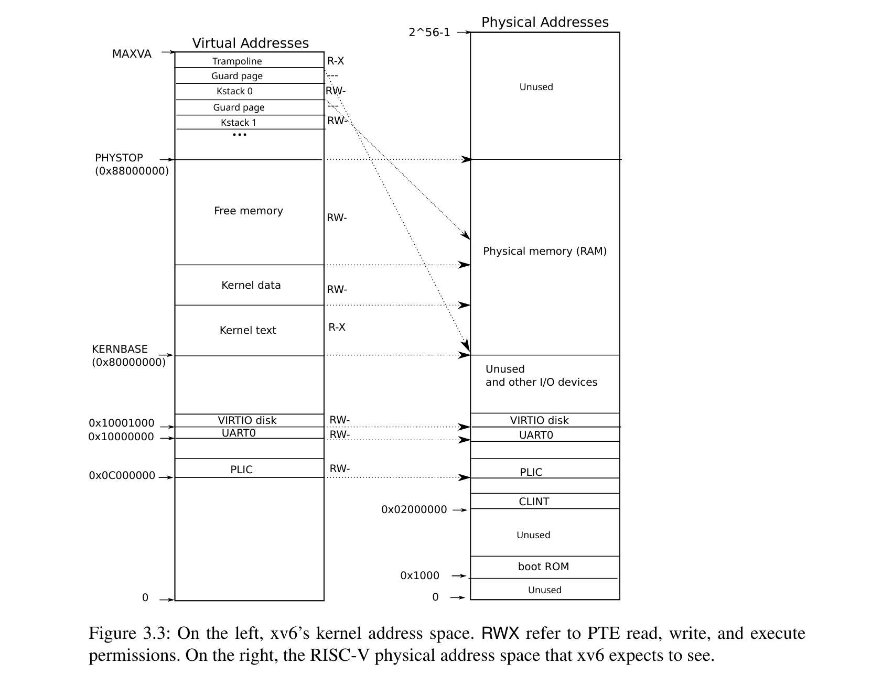

## 流程

1. S-MODE 创建内核页表
2. S-MODE 填写 `satp` 寄存器，开启分页
3. 在 S-MODE 和 U-MODE，MMU 按照 `satp.MODE` 自动进行地址翻译

## 相关特权级

* M-MODE：无分页（直接映射）
* S-MODE：控制和使用分页，MMU 在此等级能访问物理地址
* U-MODE：使用分页，MMU 在此等级不能访问物理地址

## 相关寄存器

### Supervisor Address Translation and Protection (satp) Register

* `MODE`：当前地址转换方案
* `ASID`：地址空间标识符，用于切换进程页表
* `PPN(Physical Page indeX)`：根页表 PPN


## 相关命令

### SFENCE.VMA

SFENCE.VMA 用于刷新与地址转换相关的本地硬件缓存

详见 [RISC-V Privileged Architecture](https://github.com/riscv/riscv-isa-manual/releases/download/Priv-v1.12/riscv-privileged-20211203.pdf) 4.2.1

## 内存布局

### QEMU

```c
// qemu/include/exec/hwaddr.h
typedef struct MemMapEntry {
    hwaddr base;
    hwaddr size;
} MemMapEntry;
// qemu/hw/riscv/virt.c
static const MemMapEntry virt_memmap[] = {
    [VIRT_DEBUG] =        {        0x0,         0x100 },
    [VIRT_MROM] =         {     0x1000,        0xf000 },
    [VIRT_TEST] =         {   0x100000,        0x1000 },
    [VIRT_RTC] =          {   0x101000,        0x1000 },
    [VIRT_CLINT] =        {  0x2000000,       0x10000 },
    [VIRT_ACLINT_SSWI] =  {  0x2F00000,        0x4000 },
    [VIRT_PCIE_PIO] =     {  0x3000000,       0x10000 },
    [VIRT_PLATFORM_BUS] = {  0x4000000,     0x2000000 },
    [VIRT_PLIC] =         {  0xc000000, VIRT_PLIC_SIZE(VIRT_CPUS_MAX * 2) },
    [VIRT_APLIC_M] =      {  0xc000000, APLIC_SIZE(VIRT_CPUS_MAX) },
    [VIRT_APLIC_S] =      {  0xd000000, APLIC_SIZE(VIRT_CPUS_MAX) },
    [VIRT_UART0] =        { 0x10000000,         0x100 },
    [VIRT_VIRTIO] =       { 0x10001000,        0x1000 },
    [VIRT_FW_CFG] =       { 0x10100000,          0x18 },
    [VIRT_FLASH] =        { 0x20000000,     0x4000000 },
    [VIRT_IMSIC_M] =      { 0x24000000, VIRT_IMSIC_MAX_SIZE },
    [VIRT_IMSIC_S] =      { 0x28000000, VIRT_IMSIC_MAX_SIZE },
    [VIRT_PCIE_ECAM] =    { 0x30000000,    0x10000000 },
    [VIRT_PCIE_MMIO] =    { 0x40000000,    0x40000000 },
    [VIRT_DRAM] =         { 0x80000000,           0x0 }, // 用户传参
};
```

* DRAM 地址：`0x80000000~PHYSICAL_MEMORY_TOP`
  * OpenSBI, U-boot：`0x80000000~0x80200000`
  * 内核地址：`0x80200000~kernelEnd`
  * 空闲地址`kernelEnd~PHYSICAL_MEMORY_TOP`

### S-MODE 内核地址空间



由于 S-MODE 拥有访问物理地址几乎全部权限，我们将大部分的地址设为直接映射，
即虚拟地址和物理地址相等。这保证了访问物理内存和外设的简易性。

采取直接映射的部分有：

* MMIO
* kernel

特殊地址（用户线程相关的地址 & 需要复用的地址）采取非直接映射：

* trampoline
* kernel stack pages

### U-MODE 用户地址空间


用户地址空间将在 process 部分进行详细介绍

### 问题

> Xv6 is simplified by the kernel’s use of a direct map between virtual and physical addresses, and by its assumption that there is physical RAM at address 0x8000000, where the kernel expects to be loaded. This works with QEMU, but on real hardware it turns out to be a bad idea; real hardware places RAM and devices at unpredictable physical addresses, so that (for example) there might be no RAM at 0x8000000, where xv6 expect to be able to store the kernel. More serious kernel designs exploit the page table to turn arbitrary hardware physical memory layouts into predictable kernel virtual address layouts.

## 分页方式

### Sv39

Page-based 39-bit virtual addressing

将 39 位虚拟地址映射到 56 位物理地址


在 RISC-V 中，PTE 有两种：

* 叶 PTE：指向一个物理页 PPN
* 非叶 PTE：指向一个页表 PPN

根据 `RWX` 位决定


位于任何级的 PTE 都可能成为叶 PTE，非最低级的 PTE 作为叶 PTE 时则会形成一个超级页

具体翻译过程如下：

1. 定义 $a=satp.ppn\times PAGESIZE,i=LEVELS-1$ 对于 `Sv39`，$PAGESIZE=2^{12},LEVELS=3$
2. 定义 $pte$ 为指向地址为 $a+va.vpn[i]\times PTESIZE$ 的 PTE 的指针
3. 检查 $pte$ 权限
4. 若有效
   * 如果 $pte.r=1$ 或者 $pte.x=1$，则 $pte$ 为叶 PTE，转向 STEP 5
   * 否则 $pte$ 指向下一层级的页表，令 $i=i-1,a=pte.ppn\times PAGESIZE$，转向 STEP 2
5. 找到叶 PTE，检查 $pte$ 权限
6. 若 $i>0$ 并且 $pte.ppn[i-1:0] \neq 0$，说明这是一个未对齐的超级页，抛出异常
7. 检查和调整 $pte.a,pte.d$
8. 生成物理地址
   * $pa.pageoff=va.pageoff$
   * 若 $i>0$，这是一个超级页，$pa.ppn[i-1:0]=va.vpn[i-1:0]$
   * $pa.ppn[LEVELS-1:i]=pte.ppn[LEVELS-1:i]$

注意页的大小可能为 `4KB`，`2MB(megapages)`，`1GB(gigapages)`，需要按照其大小进行地址对齐

## 函数介绍

* pageWalk()
* pageLookUp()
* pageInsert()
* ...

## Q&A

Q：`satp.MODE` 有何意义\
A：填写 `satp.MODE` 后，MMU 自动按照规则将虚拟地址翻译为物理地址。\
如果该虚拟地址还未分配，则触发缺页异常并且由异常处理程序分配物理空间。

Q：PPN 和物理地址是一一对应的吗？\
A：是的。PPN，Page Control Unit 和 Page 都是一一对应的

Q：M-MODE 需要分页吗？\
A：M-MODE 无分页机制，直接访问对应物理地址

Q：S-MODE MMU 如何完成翻译？\
A：S-MODE MMU 位于物理和虚拟的边界，它能够直接读取/修改物理地址

Q：U-MODE MMU 无法访问物理空间，那么它如何完成地址翻译工作？\
A：U-MODE MMU 在需要访问物理地址的时候，需要通过系统调用从更高的特权级请求读取操作

## 附录

附录介绍了一些此处出现，其他地方会介绍但是还未介绍的内容

### Trampoline

A：M-MODE 无分页机制，直接访问对应物理地址
在 RISC-V中，trampoline 是一小段代码，用于在特权模式之间进行跳转。

> 当进程进入 Trap 时，内核会运行 trampoline 中的代码，并且将寄存器信息保存在 trapframe 页面中。

U-MODE MMU 无法访问物理地址，将会产生异常。异常被捕获后进入 Trap，
由 trampoline 中系统调用保存现场提升权限（在这里是 S-MODE）并处理异常（返回物理地址对应数据）

## Reference

* [xv6 Guide](https://pdos.csail.mit.edu/6.828/2022/xv6/book-riscv-rev3.pdf)
  * Chapter 3 Page Tables

* [xv6-book翻译(自用)第三章](https://zhuanlan.zhihu.com/p/434095914)

* [RISC-V Privileged Architecture](https://github.com/riscv/riscv-isa-manual/releases/download/Priv-v1.12/riscv-privileged-20211203.pdf)
  * Chapter 4 Supervisor-Level ISA, Version 1.12
    * Section 1 Supervisor Instructions
      * Subsection 11  Supervisor Address Translation and Protection (satp) Register
    * Section 2 Supervisor Instructions
    * Section 3 Sv32: Page-Based 32-bit Virtual-Memory Systems
    * Section 4 Sv39: Page-Based 39-bit Virtual-Memory System

* [SiFive FU740-C000 Manual v1p6](https://sifive.cdn.prismic.io/sifive/1a82e600-1f93-4f41-b2d8-86ed8b16acba_fu740-c000-manual-v1p6.pdf)
  * Chapter 4 U74 RISC-V Core
    * Section 7 Virtual Memory Support