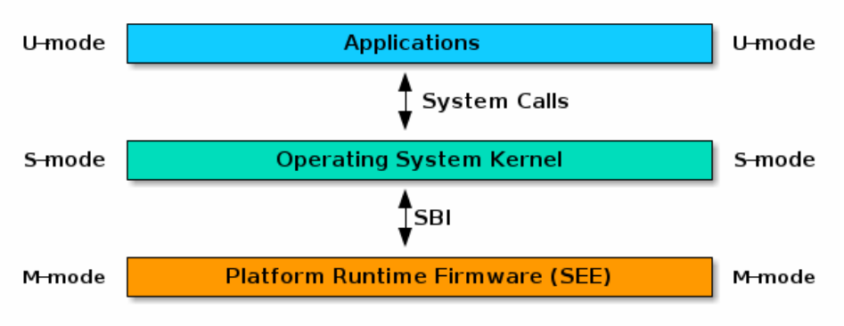
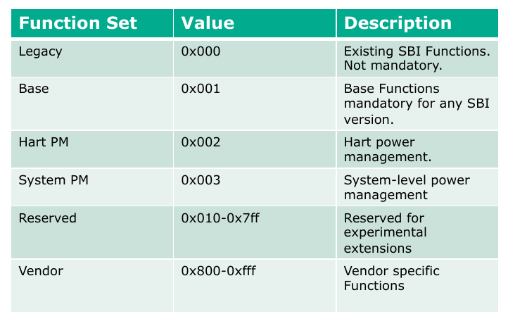
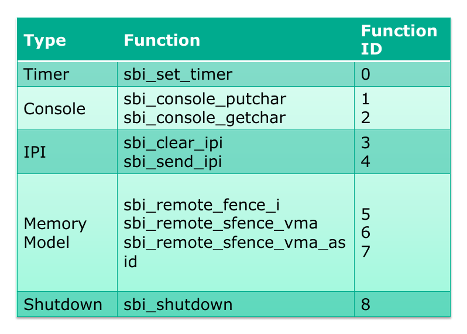

# SBI

## 直观理解

SBI 是运行是 RISCV 特有的，运行在操作系统之下，硬件之上的一组服务。在 RISCV 的设计中，操作系统并不直接控制硬件，在硬件和操作系统之间，还有一层 SEE（Supervisor Execution Environment），SBI 就是构建在 SEE 层上的服务，SBI 就是构建在 SEE 上的一组服务，如图所示：

可以看到 SEE 是在 M 等级下的，而 OS 是在 S 等级下的。关于这个事情，可以理解成 SEE 分担了 OS 的部分工作，这个设计类似于网络的分层设计，通过构建中间层，分担 OS 的部分职责，使得 OS 的设计简洁性提高。

SBI 既可以看做是一组服务，其实现也可以看做是“操作系统的操作系统”，它是一个软件，较为常用的实现有 `openSBI`，`rustSBI` 。

此外，SBI 和 ABI 在 RISCV 中可以被抽象成同一个概念 EEI：

RISC-V 程序的行为取决于其运行的执行环境。RISC-V 执行环境接口（EEI）定义了程序的初始状态，环境中支持的 hart 的数量和类型，包括 hart 支持的特权模式，内存和 I/O 区域的可访问性和属性，所有在每个 hart 上执行的合法指令的行为（即 ISA 是 EEI 的一个组成部分），以及处理执行期间引发的任何中断或异常，包括环境调用。 EEI 的示例包括 Linux 应用程序二进制接口（ABI）或 RISC-V 监管程序二进制接口（SBI）。 RISC-V 执行环境的实现可以是纯硬件、纯软件或硬件和软件的组合。例如，可以使用 opcode traps 和软件仿真来实现硬件中未提供的功能。

---

## Legacy Extension

SBI 因为被 the RISC-V Unix class platform specification 纳入规范，所以在规格上面发生了一些变化。现有的SBI规范将被考虑为遗留扩展。其他的SBI特性集将是基于基础规范的独立扩展，每个扩展将成为一个子规范。

我们是使用的正是遗留拓展（Legacy Extension）。它的调用规范和基础拓展不一样。

旧的 sbi 被称为 0.1 版本，而新的 sbi 被称为 0.2 版本。0.2 版本最大的特性就是可以指定不同的服务集合（模块化的思想和 RISCV 的模块化有些类似）。

---

## Call Convention

0.1 SBI 的调用规范如下：

- 利用 `ecall` 指令在 S 级自陷（`trap`）入 M 级调用。
- 通过 `a0 ~ a3` 传递参数。
- 通过 `a0` 传递返回值。
- 通过 `a7` 指定服务类型。 

具体的服务如下

---

## OpenSBI Src

OpenSBI 的项目目录架构如下所示：

- `firmware/`：主要包括加载起始文件。
  - `fw_base.S`：“起始的抽象基类”，会调用 `fw_dynamic.S, fw_payload.S, fw_jump.S ` 的实现。

- `lib/`：主文件目录
  - `sbi/`：所有服务的实现。
  - `utils/`：用于设备树解析 `libfdt` 以及其他的驱动文件。
- `platform/`：定义属于板卡特有的代码。

----

## Boot

sbi 不仅可以作为一个运行环境服务，同时它还创新性的参与了 boot 的流程，具体的介绍在 `boot.md` 中涉及。

---

