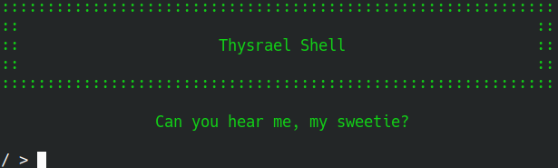
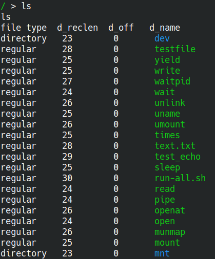
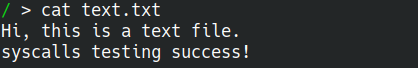
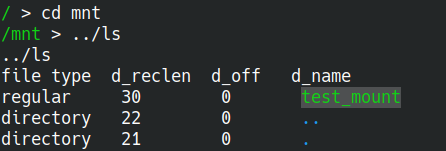

# Shell

本项目中 shell 名为 Thysrael Shell

## 初始化

使用 `dev` 系统调用初始化标准输入输出，
通过 `tty` 进行交互

## 显示工作目录

使用 `getcwd` 系统调用获取当前工作目录

## 获取用户指令

使用 `read` 系统调用读取键盘输入

注意到读入的数据遵循 ANSI 规范

特别的，以下输入将特殊处理：

- CTRL+C：重置当前读入
- CTRL+D：若目前没有读入，杀死终端
- ENTER：结束读入

## 解析用户指令

我们采取递归下降法解析用户指令，
支持内部命令 / 外部命令，
支持重定向，多管道，外部参数等功能

用户指令分为内部命令和外部命令

内部命令，内嵌于 shell：

- `cd`：当前目录跳转，调用 `chdir` 系统调用实现
- `quit`：退出终端，调用 `exit` 系统调用实现
- `clear`：清空屏幕，使用 ANSI 标准实现

在读取命令后，首先将程序和内部命令进行匹配。
内部命令不依赖于文件系统，环境变量等，
能够保证任何情况下 shell 最低程度的可用性

外部命令，使用 `exec` 调用：

- `ls`：显示当前目录下的文件和目录
- `cat`：将文件内容输出到标准输出
- `echo`：显示一行字符串

后期我们还将继续丰富外部命令，
以给予使用者更完善的体验

支持的功能：

- `args`：外部参数
- `<`，`>`，`>>`：I/O 重定向
- `|`：管道

## 高级功能

### 打印并压缩路径

我们在命令的每一行都打印了当前路径，
并且实现了路径的压缩。
即当前出现 ENV 中 HOME 对应的路径时，
会将其压缩为 `~`。
同样，类似于 `fish`，在路径较长时，
支持只保留每级文件夹的首字母，
防止占用过多屏幕空间

## 展示

## 未来将实现的一些功能

- 支持环境变量
- 更多的外部命令
- 更好的命令行输入支持
  - 历史记录
  - 命令补全
  - 错误提示
