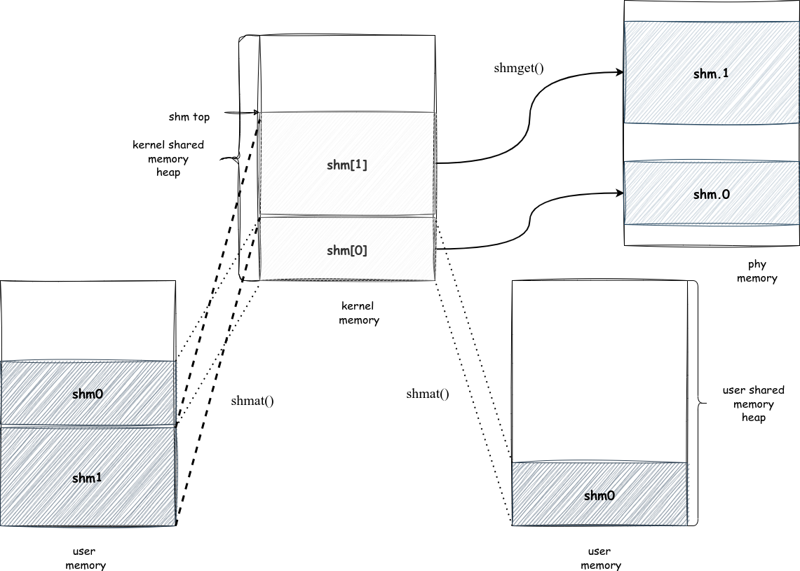

# Shared Memory

## 系统调用

获得一片共享内存。

```c
int shmget(int key, long long size, int shmflg);
```

将共享内存与一片用户内存对应起来：

```c
uintptr_t shmat(int shmid, long long addr, int shmflg);
```

对这片共享内存进行控制

```c
shmctrl
```

删除共享内存

```c
shmdt
```

## 设计实现

### 设计概览



将不同用户空间的虚拟内存映射到同一片物理内存上，就可以实现共享内存。

首先在 `shmget()` 时，在内核的堆上分配一片内存，建立与物理内存的映射，向用户进程返回 `sid`  用来识别不同的共享内存。在进行 `shmat()` 的时候，将用户堆上分配一片内存，根据 `sid` 将这片用户内存与对应的物理内存完成映射。

### 数据结构

在实现的过程中，需要维护内核和用户两种堆结构，此外还需要维护共享内存控制块，用于记录贡献内存的大小和起始地址，本质是在记录用于共享内存的物理内存的性质。
