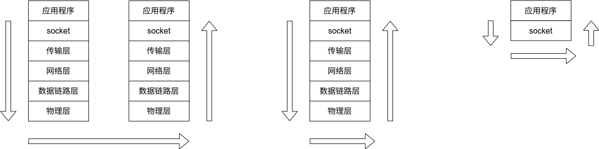
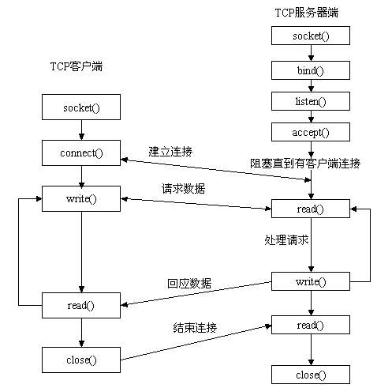
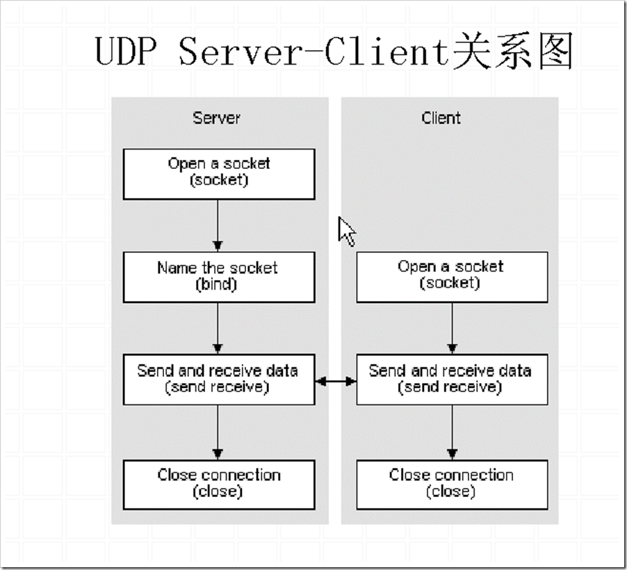

# socket

## 本地网络的实现简化

如果网络的实现仅在本地，那么可以简化实现的难度，也就是如下图所示：

左侧是最为完全的网络实现，中间则对应只有本地程序通信的情况，可以看到此时数据在多层协议栈中的传输就显得不是那么的必要了，可以直接减少协议栈的内容，完成最右侧的实现。

## socket API

### socket 的操作

- socket()：创建一个 socket。
- bind()：为创建的 socket 绑定一个地址，这个函数一般被 server 调用，用于设置地址。这可能是因为只有 server 需要显式的声明自己的地址，方便 client 的访问，而 client 却不需要。这可能是一种 server-client 模型中不对等关系的体现。
- listen()：使 socket 变成监听状态，也是只被 server 调用。
- accept()：server 调用，接受 client 的连接请求，和 client 建立联系。
- connect()：client 调用，用于向 server 发送连接请求。
- close()：关闭 socket。
- getsocketname()：获得 socket 的地址。关于地址信息，其实和 socket 一样，也有很多种类，对于 IPv4 来说，一般是 16 字节大小。
- getsockopt()：获得 socket 的配置项。
- setsockopt()：配置 socket，可以配置的内容非常多，同时也随着不同的 socket 种类而发生变化

### socket 的种类

需要注意的是，socket 是多样的，不同的 socket 对于操作的表现是不同的，所以在实现的时候推荐使用函数指针进行“多态”的模拟。比如说其实 UDP socket 的 listen() 是不会被使用的（因为本质是不可靠传输），connect 只是将 server 地址绑定，并没有 TCP 中确认的意思。

从系统调用来看，一个 socket 的种类是被 `(family, type, protocal)` 三元组确定的，但是这个三元组中的元素并非完全正交，给我感觉更像是一个树形结构。

### socket 的时序

我们在网上一般去搜索，会发现 socket 的时序是如图的：

但是这其实是 TCP 的时序，只有 TCP 会有复杂的“确认连接”机制。

> 此外多插一嘴，TCP 在 accept 后会创建一个新的 socket 用于和 client 的 socket 通信，而原来的 socket 只是发挥确认连接作用，并不参与通信，这是因为一个 server 可能会与多个 client 通信，所以需要生成多个 socket 

而如果搜索 UDP，则会发现时序会更加简单，也就是如下所示：

可以看到少掉了 accept 和 connect 的流程。