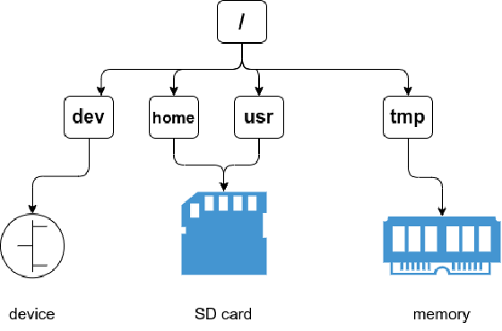

# tmpfile

## 设计

在 /tmp 文件夹的文件为临时文件，不需要在 SD 卡中存储，所以如果在 tmp 文件夹下的操作可以被放到内存中，不再写回外存。

在实现的时候，在创建文件和打开文件的时候增加对于特定目录（也就是 tmp 的特判），然后在内存中创建或者打开临时文件。

对应需要实现相应的文件操作，然后在进行系统调用时增加这类操作的分支判断。

因为不需要读写 SD 卡，所以大大提高了临时文件的 IO 带宽。

## 虚拟文件系统

借助 VFS 可以直接使用`open()`、`read()`、`write()`这样的系统调用操作文件，而无须考虑具体的文件系统和实际的存储介质。

这个概念并非单纯的“一切皆文件”的抽象，或者说“更加的一切皆文件”。之前我们将管道或者套接字抽象成文件时，其实并没有考虑他们在文件树中的位置，所以当前的文件树是十分静态的，只能用于描述 FAT32 格式的文件叔。这个缺点在实现临时文件的时候十分明显（在文件树检索的时候需要大量特判）。

所以更好的方式是在文件树层次就实现一层抽象，这样方便接入不同的需求。