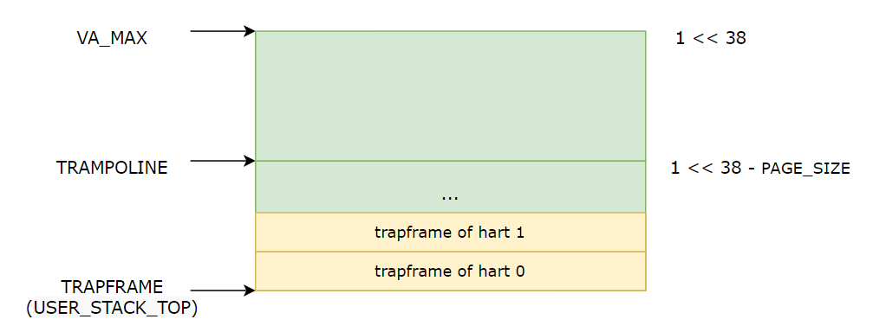

# Trap

## concept

Trap 分类

* trap 
  * exception
    * ecall
    * page load
    * page store
  * interrupt
    * timer
    * external interrupt

## trap machinery

### trap 相关寄存器

- `stvec`：内核将自己的 trap 处理函数的地址保存在这个寄存器里。
- `sepc`：当 Trap 发生时，RISC-V 将程序计数器（PC）的值保存在这个寄存器里。`sret`（从trap中返回）指令将`sepc`复制到`pc`中。内核可以写`sepc`来控制`sret`的返回到哪里。
- `scause`：RISC-V 将 Trap 的原因保存在这个寄存器里。
- `sstatus`：该寄存器里的 `SIE` 位控制着中断（interrupt）是否被启用，如果 `SIE` 位被设置位 0，RISC-V 将忽略所有的设备中断直到 `SIE` 位被置为1。该寄存器里的 `SPP` 位表示 trap 来自 `user` 模式还是 `supervisor` 模式，并控制 `sret` 返回到什么模式。

上述寄存器与在 `supervisor` 模式下处理的trap有关，在用户模式下不能读或写。对于 `machine` 模式下处理的 trap，有一组等效的控制寄存器；xv6 只在定时器中断的特殊情况下使用它们。

多核芯片上的每个 CPU 都有自己的一组这些寄存器，而且在任何时候都可能有多个CPU在处理一个 trap。

### trap 相关指令

- `ecall` ：(environment call)，当我们在 S 态执行这条指令时，会触发一个 ecall-from-s-mode-exception，从而进入 M 模式中的中断处理流程（如设置定时器等）；当我们在 U 态执行这条指令时，会触发一个 ecall-from-u-mode-exception，从而进入 S 模式中的中断处理流程（常用来进行系统调用）。
- `sret`：用于 S 态中断返回到 U 态，实际作用为pc←sepc，回顾**sepc**定义，返回到通过中断进入 S 态之前的地址。
- `ebreak`：(environment break)，执行这条指令会触发一个断点中断从而进入中断处理流程。
- `mret`：用于 M 态中断返回到 S 态或 U 态，实际作用为pc←mepc，回顾**sepc**定义，返回到通过中断进入 M 态之前的地址

### trap 硬件流程

当需要执行trap时，RISC-V 硬件对所有的 trap 类型（除定时器中断外）进行以下操作：

1. 如果该 trap 是设备中断，且`sstatus` **SIE**位为0，则不执行以下任何操作。
2. 通过清除 SIE 来禁用中断。
3. 复制 `pc` 到 `sepc`。
4. 将当前模式（用户态或特权态）保存在 `sstatus` 的**SPP**位。
5. 在 `scause` 设置该次trap的原因。
6. 将模式转换为特权态。
7. 将 `stvec` 复制到 `pc`。
8. 从新的 `pc` 开始执行。

## trapframe 

```c
typedef struct Trapframe
{
    u64 kernelSatp;
    u64 kernelSp;
    u64 trapHandler; // trap handler address
    u64 epc;         // error pc
    u64 kernelHartId;
    u64 ra;
    u64 sp;
    u64 gp;
    u64 tp;
    u64 t0;
    u64 t1;
    u64 t2;
    u64 s0;
    u64 s1;
    u64 a0;
    u64 a1;
    u64 a2;
    u64 a3;
    u64 a4;
    u64 a5;
    u64 a6;
    u64 a7;
    u64 s2;
    u64 s3;
    u64 s4;
    u64 s5;
    u64 s6;
    u64 s7;
    u64 s8;
    u64 s9;
    u64 s10;
    u64 s11;
    u64 t3;
    u64 t4;
    u64 t5;
    u64 t6;
    u64 ft0;
    u64 ft1;
    ...
    u64 ft11;
} Trapframe;
```

trapframe 是一个结构体。trapframe 在两个地方被使用。

* 每个 hart 都有一个 trapframe，这个用于在异常发生时保存上下文。
* 在 Process 结构体中，一个进程对应一个 trapframe，在进程的控制块中，这个用于在进程休息时保存上下文，在这个进程重新被调度时从中恢复。

异常处理用到的 trapframe 是上述第一种。

hart 对应的 trapframe 位于虚拟地址 TRAPFRAME，大小为一页，在内核页表和进程页表中，都把这一页映射到虚拟地址 `TRAPFRAME` ，一个 hart 的 trapframe 位于虚拟地址 TRAPFRAME + hartid * sizeof(Trapframe)，通过 `getHartTrapframe()` 函数可以获取到当前 hart 的 trapframe 的地址。

进程开始运行的时候会把 trapframe 的地址放在 sscratch 寄存器中，这样在发生用户态异常时，异常处理程序可以拿到 trapframe 的地址。

## trampoline

`trampoline` 是一段地址，大小为 `pgsize`，内核页表和所有进程页表都把这一页映射到 `TRAMPOLINE` ，也就是说每个进程都可以通过 `TRAMPOLINE` 访问到同一个物理页。这段地址放着用户态异常处理函数以及从异常恢复的代码。

在用户进程发生异常的时候，会跳转到 `trampoline` 中的 `userTrap` 进行异常处理，从异常返回的时候，会调用 `userReturn` 函数。

**为什么要把在所有进程页表和内核页表的 trapframe 和 trampoline 映射到同一个地方？**

因为在处理用户态进程异常的时候要进行**切换页表**，即在从用户态进程进入异常处理的时候要切换到内核页表，从异常处理返回用户态进程的时候要切换到用户态进程的页表。但是“切换页表”这个动作也是由一句代码实现的，这个代码被放在哪里呢？如果只能在用户页表下可以访问，那么从用户页表切换到内核页表之后，这句“切换页表”的代码之后的代码就无法访问了，所以我们必须保证在用户页表和内核页表中都能访问到这句“切换页表”及其前后的代码，并且他们映射到同一个虚拟地址。 `trampoline` 就是上述放置“切换页表”代码的地方。

而 `trapframe` 是用来保存陷入内核时的上下文的，在切换页表前后都要使用，所以也必须满足 “用户页表和内核页表都能访问”。

异常处理的流程：

* 保存寄存器信息
* 切换页表
* 跳到 usertraphandler
* 切换页表
* 加载寄存器信息
* sret

trampoline 和 trapframe 在内存中的位置如下图所示：

  


## Trap 初始化

```c
void trapInit()
{
    printk("Trap init start...");

    // 1. 设置 stvec 寄存器到中断处理函数
    writeStvec((u64)kernelTrap);

    // 2. 设置 sie 寄存器，使能中断
    writeSie(readSie() | SIE_SSIE | SIE_STIE | SIE_SSIE);

    // 3. 设置 sip（当前待处理的中断） 为 0
    writeSip(0);

    // 4. 设置 sstatus 的 SIE, SPIE
    writeSstatus(readSstatus() | SSTATUS_SIE | SSTATUS_SPIE);
}
```

在系统初始化的时候，会将 `stvec` 寄存器设置为 `kernel_trap.S/kernelTrap` 函数的地址。

开始运行一个用户态进程或者从异常中返回到用户态进程的时候，会将 `sscratch` 寄存器设置为 `userTrap` 的地址。

从用户态进入内核态的时候，会将 `sscratch` 寄存器设置为 `kernelTrap` 的地址。

## 异常处理流程

异常处理分为用户态的异常处理和内核态的异常处理，分别对应 `user_trap.S/userTrap` 和 `kernel_trap.S/kernelTrap` 函数。

### 内核态异常处理

处理外部中断和时钟中断，发生异常时跳转到 `kernel_trap.S/kernelTrap` 函数，该函数会调用 `kernelHandler` 函数，根据异常类型调用不同的处理函数。

`kernelHandler` 函数处理步骤如下：

1. 将寄存器存入栈中
2. 调用 `kernelHandler`
   1. 处理时钟中断和外部中断
3. 将寄存器从栈中取出，回到 `epc` 处继续执行

### 用户态异常处理

sscratch 寄存器中保存着 trapframe 的地址 (这个寄存器在进程切换或者新建进程的时候会被改成当前进程的 trapframe 地址)。 `userTrap` 函数处理步骤如下
1. 从 sscratch 中取出 trapframe 的地址，将寄存器保存在 trapframe 中
2. 将 `sp` 设置为内核栈指针，将 `satp` 设置为内核页表
1. 调用 `userHandler` 函数：
   1. `userHandler` 函数根据异常/中断的不同类型调用处理函数，处理了**时钟中断、外部中断，系统调用和缺页异常**
   2. 调用 `userTrapReturn` ：
      1. 设置 stvec 为 `user_trap.S/userTrap`
      2. 设置 trapframe 中的 usetHandler 和 kernelSp
      3. 调用 `user_trap.S/userReturn` :
         设置用户进程页表、sscratch 寄存器，将寄存器从 `trapframe` 中取出，返回到用户态

