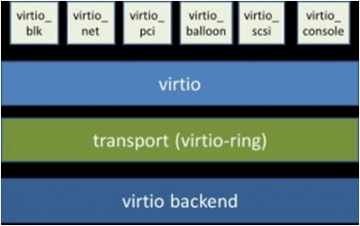

# Virtio

## 架构和任务

### 架构

Virtio 是一种前后端架构，包括前端驱动（Guest 内部）、后端设备（QEMU 设备）、传输协议（vring）。框架如下图所示：



这三个部分的介绍如下：

- 前端驱动：虚拟机内部的 virtio 模拟设备对应的驱动。作用为接收用户态的请求，然后按照传输协议对请求进行封装，再写 I/O 操作，发送通知到 QEMU 后端设备。
- QEMU 后端设备：在 QEMU 中创建，用来接收前端驱动发送的 I/O 请求，然后按照传输协议进行解析，在对物理设备进行操作，之后通过终端机制通知前端设备。
- 传输协议：使用 virtio 队列（virtio queue）完成。设备有若干个队列，每个队列处理不同的数据传输。virtqueue 通过 vring 实现。Vring 是虚拟机和后端设备之间共享的一段环形缓冲区，后端设备和前端设备都可以从 vring 中读取数据和放入数据。

### 核心机制

virtio 有两个核心机制：**前后端消息通知机制**和**数据共享机制**。

**消息通知机制**，前端驱动设备产生IO请求后，可以通知后端 QEMU 进程去获取这些 IO 请求，递交给硬件。

**数据共享机制**，前端驱动设备在虚拟机内申请一块内存区域，将这个内存区域共享给后端 QEMU 进程，前端的 IO 请求数据就放入这块共享内存区域，QEMU 接收到通知消息后，直接从共享内存取数据。虚拟机的内存都是 QEMU 申请和分配的，属于 QEMU 进程的线性地址的一部分，因此虚拟机只需将这块内存共享区域的**地址**（这里说明数据结构的传递方式是通过信息的地址传递）传递给 QEMU 进程，QEMU 就能直接从共享区域存取数据。

### 任务

作为操作系统开发，我们只需要实现前端驱动部分，并遵从 transport 协议将对于设备的读写需求，合理合规地传递给后端即可。所以我们实现的重点是前端和传输协议。


## Legacy

virtio 分为两个版本，一个是 legacy，一个是 modern。当 qemu 参数中加入如下所示的参数时，则选择 modern 参数

```shell
QFLAGS += -global virtio-mmio.force-legacy=false
```

但是不幸的是，我们并没有要求这个选项，所以我们的 virtio 是 legacy 的，这是和 xv6 的 virtio 驱动是不同的。

virtio 的版本也可以通过读取配置空间的 `VIRTIO_MMIO_VERSION 0x004` 来获得，legacy 对应 `version == 1` ，modern 对应 `version == 2` 。我们需要 `version == 1` 。

两者的区别主要在内存布局和数据结构的实现方式上有一定差别，其通信机理没有本质差别。


## PCI 配置空间

### PCI

virtio 设备都是 PCI 设备，它们挂在 PCI 总线上，遵循通用 PCI 设备的发现、挂载等机制。

PCI（Peripheral Component Interconnect，外围设备互联）是一种总线结构或者说总线协议，PCI 设备就是遵循 PCI 协议的设备。其协议的内容似乎和很多数字电路的知识相关，涉及到带宽，并行，行波等信息。在我看来，总线协议在某种意义上，和计算机网络中的协议具有一定的相似性。

### 配置空间

当虚拟机启动发现 virtio PCI 设备时，只有配置空间可以被访问，配置空间内保存着该设备工作所需的信息，如厂家、功能、资源要求等，通过对这个空间信息的读取，完成对 PCI 设备的配置。

我们用 MMIO 的形式对其进行配置，具体的映射如下，我们从如下地址开始映射（这可能是 PCI 核心驱动规定和实现的，我们遵循即可）

```c
// virtio mmio interface
#define VIRTIO (0x10001000ULL)
```

以这个地址为起始地址，我们可以读写 PCI 设备上的 32 位寄存器，写成一个宏

```c
// 利用的是 mmio 的原理，从 VIRTIO 这个地址开始访问 virtio 的寄存器
// 这里读出的都是地址
#define VIRTIO_ADDRESS(r) ((volatile u32 *)(VIRTIO + (r)))
```

寄存器的偏移总结如下：

```c
// virtio mmio control registers, mapped starting at 0x10001000.
// 这里记录的是所有寄存器的偏移
#define VIRTIO_MMIO_MAGIC_VALUE 0x000 // 0x74726976
#define VIRTIO_MMIO_VERSION 0x004     // version; should be 1
#define VIRTIO_MMIO_DEVICE_ID 0x008   // device type; 1 is net, 2 is disk
#define VIRTIO_MMIO_VENDOR_ID 0x00c   // 0x554d4551
#define VIRTIO_MMIO_DEVICE_FEATURES 0x010
#define VIRTIO_MMIO_DRIVER_FEATURES 0x020
#define VIRTIO_MMIO_QUEUE_SEL 0x030        // select queue, write-only
#define VIRTIO_MMIO_QUEUE_NUM_MAX 0x034    // max size of current queue, read-only
#define VIRTIO_MMIO_QUEUE_NUM 0x038        // size of current queue, write-only
#define VIRTIO_MMIO_QUEUE_READY 0x044      // ready bit
#define VIRTIO_MMIO_QUEUE_NOTIFY 0x050     // write-only
#define VIRTIO_MMIO_INTERRUPT_STATUS 0x060 // read-only
#define VIRTIO_MMIO_INTERRUPT_ACK 0x064    // write-only
#define VIRTIO_MMIO_STATUS 0x070           // read/write
#define VIRTIO_MMIO_QUEUE_DESC_LOW 0x080   // physical address for descriptor table, write-only
#define VIRTIO_MMIO_QUEUE_DESC_HIGH 0x084
#define VIRTIO_MMIO_DRIVER_DESC_LOW 0x090 // physical address for available ring, write-only
#define VIRTIO_MMIO_DRIVER_DESC_HIGH 0x094
#define VIRTIO_MMIO_DEVICE_DESC_LOW 0x0a0 // physical address for used ring, write-only
#define VIRTIO_MMIO_DEVICE_DESC_HIGH 0x0a4
```

### init

初始化的流程是一个与 PCI 设备沟通的过程，我们用 `status` 这个变量来协商目前沟通进行到了哪一个流程。

status 按从上到下顺序进行设置

```c
// status register bits, from qemu virtio_config.h
// 属于 Device Status Field，用于指示启动流程进行了到了哪一步，在 2.1 有讲解
#define VIRTIO_CONFIG_S_ACKNOWLEDGE 1
#define VIRTIO_CONFIG_S_DRIVER 2
#define VIRTIO_CONFIG_S_FEATURES_OK 8
#define VIRTIO_CONFIG_S_DRIVER_OK 4
```

在配置 FEATURE 的时候，本质是在配置块设备的特征（virtio 不止是块设备）：

```c
u64 features = *VIRTIO_ADDRESS(VIRTIO_MMIO_DEVICE_FEATURES);
features &= ~(1 << VIRTIO_BLK_F_RO);
features &= ~(1 << VIRTIO_BLK_F_SCSI);
features &= ~(1 << VIRTIO_BLK_F_CONFIG_WCE);
features &= ~(1 << VIRTIO_BLK_F_MQ);
features &= ~(1 << VIRTIO_F_ANY_LAYOUT);
features &= ~(1 << VIRTIO_RING_F_EVENT_IDX);
features &= ~(1 << VIRTIO_RING_F_INDIRECT_DESC);
*VIRTIO_ADDRESS(VIRTIO_MMIO_DRIVER_FEATURES) = features;
```

然后配置通信结构的地址

```c
// 将通信协议涉及的地址都登记好，因为地址是 64 位的，所以需要登记两个 32 位寄存器
// printk("%lx %lx %lx\n", (u64)disk.desc, (u64)disk.avail, (u64)disk.used);
*VIRTIO_ADDRESS(VIRTIO_MMIO_QUEUE_DESC_LOW) = (u64)disk.desc;
*VIRTIO_ADDRESS(VIRTIO_MMIO_QUEUE_DESC_HIGH) = (u64)disk.desc >> 32;
*VIRTIO_ADDRESS(VIRTIO_MMIO_DRIVER_DESC_LOW) = (u64)disk.avail;
*VIRTIO_ADDRESS(VIRTIO_MMIO_DRIVER_DESC_HIGH) = (u64)disk.avail >> 32;
*VIRTIO_ADDRESS(VIRTIO_MMIO_DEVICE_DESC_LOW) = (u64)disk.used;
*VIRTIO_ADDRESS(VIRTIO_MMIO_DEVICE_DESC_HIGH) = (u64)disk.used >> 32;
```


## 通信

### 通信结构

通信结构主要由四个部分组成：

- VirtBlockReq：记录着请求的详细信息，也就是读出还是写入，对应的 sector 编号。
- VirtqDesc：请求描述表项，记录着 VirtBlockReq 的实际地址，同时又 next 域来构成一个链表，在 virtio 通信中，一个链表代表着一个请求。VirtDesc 表是通信中的中心结构。
- VringAvail：环形数据结构，用来存储一定的描述符索引，指明 VirtqDesc 中哪些项是可用的。存储的是每个 IO 请求在 VirtqDesc 中连接成的链表的表头位置。
- VringUsed：环形数据结构，存储一定的描述符索引，说明 VirtqDesc  中哪些项已经被递交到硬件。

结构如图所示：


### 通信流程

**I/O 请求过程：**

- 设备驱动在发出I/O请求时，首先把I/O请求的命令/数据等放到一个或多个 VirtBlockReq 中。
- 然后在描述符表中分配新的描述符 VirtqDesc（或描述符链）来指向这些 VirtBlockReq 。
- 再把描述符（或描述符链的首描述符）的索引值写入到可用环中，更新可用环的 idx 指针。
- 驱动程序通过 kick 机制（即写virtio设备中特定的通知控制寄存器）来通知设备有新请求。

对于 virtio blk 来说的具体细节是，每次读写均需要分配 3 个 VirtqDesc 组成描述符链表。第一个 VirtDesc 记录 VirtBlockReq 的地址，第二个 VirtDesc 记录需要读写的数据缓冲区地址（也就是 kenerl buffer），第三个 VirtDesc 记录完成状态。

当分配并填写好 VirtDesc 后，需要 `VIRTIO_MMIO_QUEUE_NOTIFY` 置 0 来提醒 qemu，此后即可进行 `sleep`。

**I/O 响应过程：**

一旦设备完成了I/O请求，形成 I/O 响应，就会更新描述符所指向的缓冲区，并向驱动程序发送已用缓冲区通知（used buffer notification）。一般会采用中断这种更加高效的通知机制。

内核收到中断后，会通过 `PLIC` 获得中断的类型，如果是 virio 中断，那么就会递交给驱动处理。驱动处理时需要将 VringUsed 的 index 进行改变，同时 wakeup 之前 sleep 的读进程。
